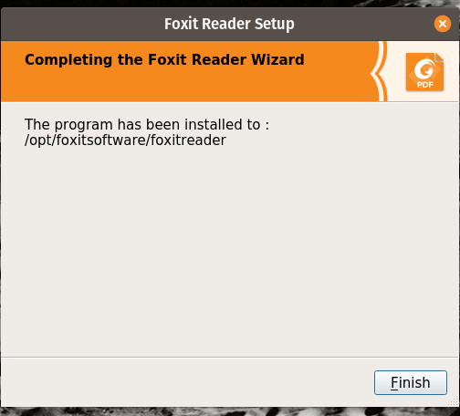

## Foxit PDF Reader

Es un reader PDF propietario, pero que permite hacer algunas cosas y ver algunos
archivos que los _open source_ no pueden.

Se baja desde [la página oficial de Foxit](https://www.foxit.com/pdf-reader/).
```
wget --directory-prefix=${HOME}/Downloads --content-disposition \
'https://www.foxit.com/downloads/latest.html?product=Foxit-Reader&platform=Linux-64-bit&version=&package_type=&language=English'
```
Para instalarlo hay que desempaquetarlo y ejecutar el instalador:
```
tar xvfz FoxitReader.*.tar.gz
sudo ~/Downloads/FoxitReader.*setup*.run
```




Al arrancarlo por primera vez, desactivar el chequeo para ver si es la
aplicación default para archivos de tipo PDF:


___
<!-- LICENSE -->
___
<a rel="licencia" href="https://creativecommons.org/licenses/by-sa/4.0/deed.es">
</a>
<br /><br />
Este documento está licenciado en los términos de una <a rel="licencia"
href="https://creativecommons.org/licenses/by-sa/4.0/deed.es">
Licencia Atribución-CompartirIgual 4.0 Internacional de Creative Commons</a>.
<br /><br />
This document is licensed under a <a rel="license" 
href="https://creativecommons.org/licenses/by-sa/4.0/deed.en">
Creative Commons Attribution-ShareAlike 4.0 International License</a>.
<!-- END --> 
