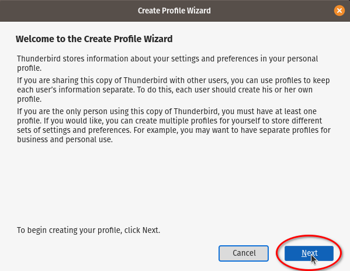
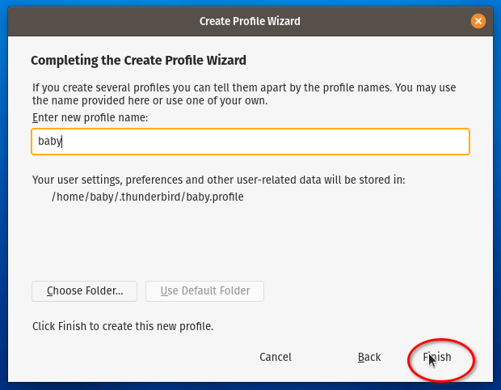
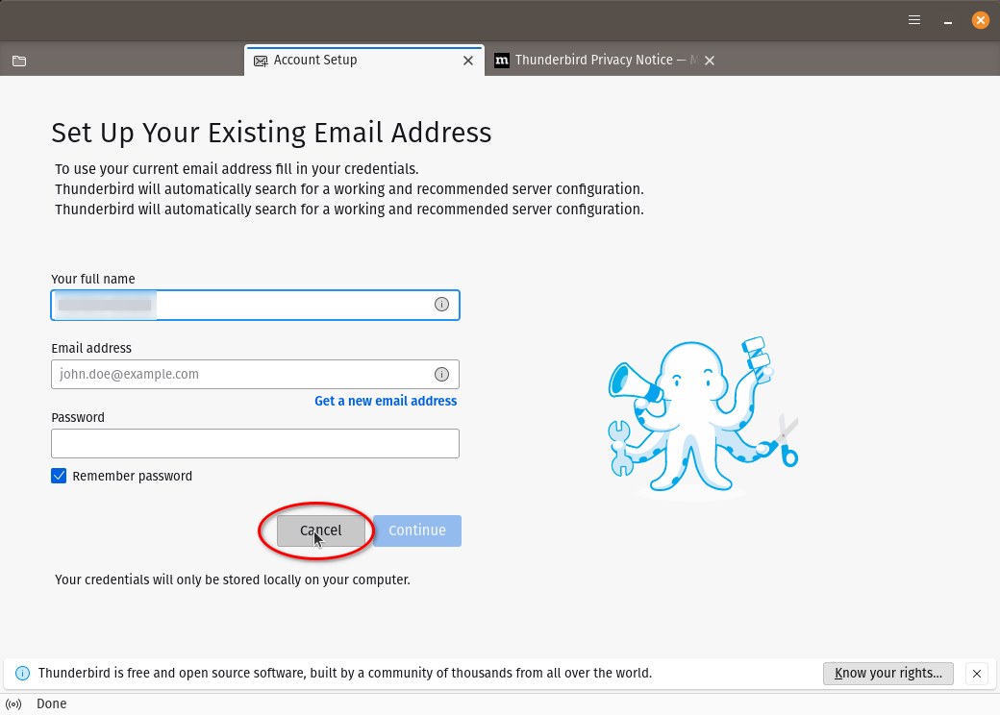
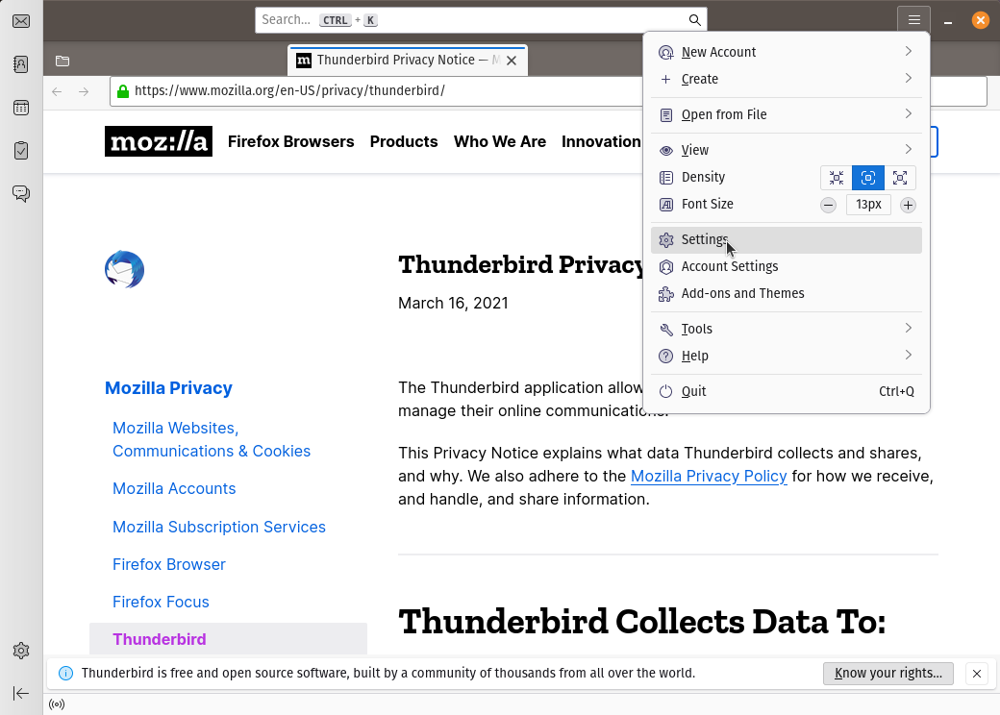
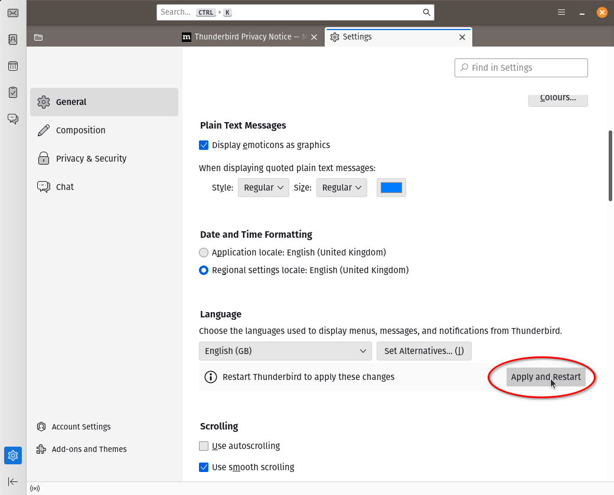
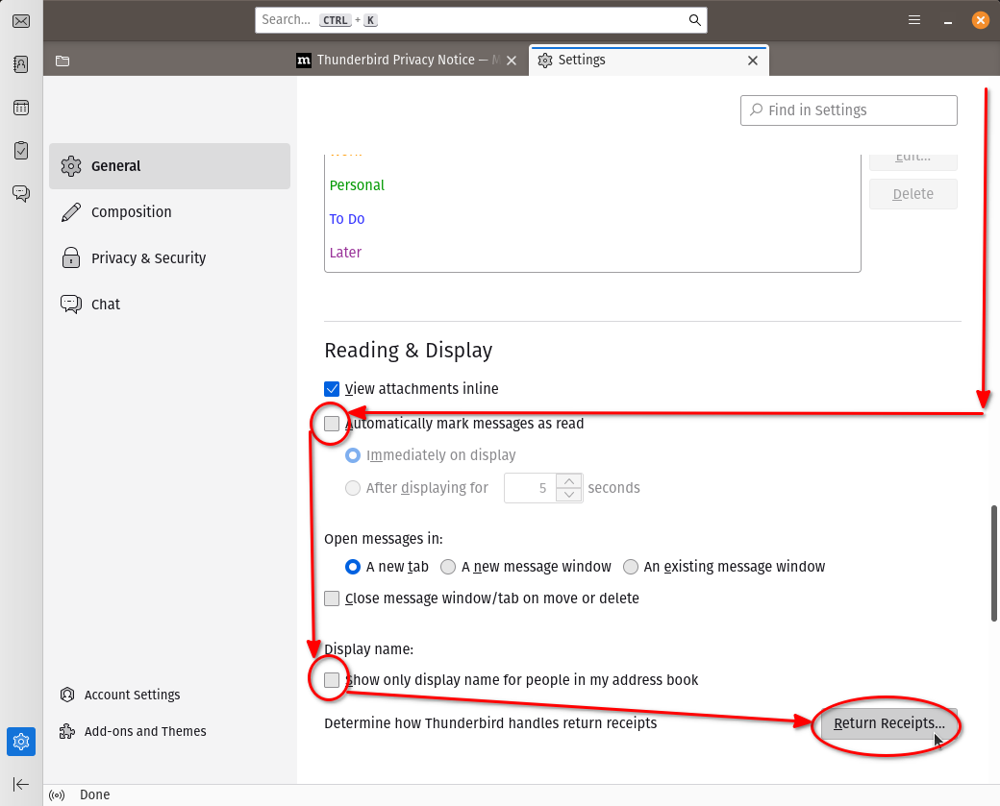
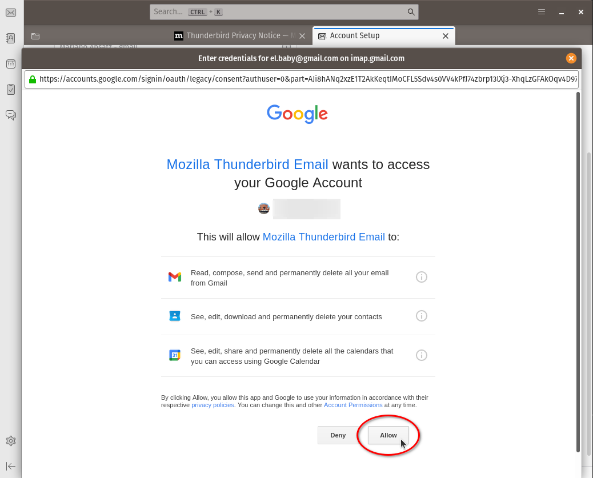

# Instalación de Linux (POP OS 20.04)

* Bajamos e instalamos con las [instrucciones oficiales](
https://support.system76.com/articles/install-pop/)
  * Usamos "_Full Disk Encryption_" con una clave distinta a la de login
* Entramos (en la UI gráfica) en **Settings** &rarr; **About** y configuramos el
**Device Name** con el nombre que le queremos poner al equipo (hostname)
* En **Settings** &rarr; **Region and Language** terminamos de instalar el
_Language Support_:


## Instalación paquetes básicos
```
# repositorio de drivers de System76
sudo apt-add-repository ppa:system76-dev/stable

# paquetes headless
sudo apt install build-essential subversion git vim openssh-server openssh-client

# paquetes UI grafica
sudo apt install gnome-tweaks synaptic thunderbird vim-gtk3
```
## Entorno `/home/baby`:
```
# backup de los archivos que vienen "de fábrica" (para que no falle el checkout)
mkdir -pv ~/.00-ENV-BACKUP
mv -v ~/.bash* ~/.profile ~/.00-ENV-BACKUP

# hacemos checkout del entorno
svn checkout http://svn.ybab.net/baby/conf/baby/home_env/ .

# Copiamos archivos del cliente ssh 
cp -v ~/MOVEME_2_.ssh/* ~/.ssh
# Esto ya debería estar así, pero por si acaso:
chmod -v 700 ~/.ssh

# Autorizamos la conexión vía ssh con mi clave pública primaria
cp -v ~/.ssh/id_rsa.pub ~/.ssh/authorized_keys
chmod -v 644 ~/.ssh/authorized_keys

# Si el equipo es seguro, hay que agregarle el ~/.ssh/id_rsa desde otro equipo

# Copiamos archivos del cliente gpg 
cp -v ~/MOVEME_2_.gnupg/* ~/.gnupg

# Copiamos archivos del cliente subversion 
cp -v ~/MOVEME_2_.subversion/* ~/.subversion
```
## _Tweaks_ de gnome shell
Abrir **Gnome Tweaks** y hacer algunos ajustes:


## _Bookmarks_ para gnome shell
Esto en general se configura desde _Files_ o el navegador de carpetas y archivos
que sea, pero es más simple clavarlo directamente en el archivo de configuración
correspondiente:
```
mkdir -pv ~/Documents/ZZ-temp
cat >> ~/.config/gtk-3.0/bookmarks <<EOF
file:///home/baby/Documents/Cuentas Cuentas
file:///home/baby/Pictures/Screenshots Screenshots
file:///tmp /tmp
file:///home/baby/Documents/ZZ-temp ZZ-temp
EOF
```

## `ksnip` para capturar pantallas (screenshots) 
La página oficial es la de [github](https://github.com/ksnip/ksnip).
En Pop OS la forma "oficial" de instalarlo es vía `flatpak`.
```
# instalar paquete flatpak
flatpak install flathub org.ksnip.ksnip
# crear una carpeta (dentro de ~/Pictures) para guardar las capturas
mkdir -pv ~/Pictures/Screenshots
```
Abrir la interfaz y cambiar algunas configuraciones (tocando `Alt+F7` o a través
del menú _Options_ &rarr; _Settings_):


En particular, **Capture save location and filename:**
`/home/baby/Pictures/Screenshots/$Y$M$D-$T.png`

En la ventana principal también conviene agregar un _delay_ para la captura:


## Cliente de mail Mozilla Thunderbird

El cliente lo instalamos al principio, desde los repositorios oficiales. Ahora
vamos a hacer una configuración personalizada.

Para eso, lanzamos el _Profile Manager_ **antes** de arrancarlo por primera vez.
Desde una terminal (dentro del entorno gráfico), tipear:
```
thunderbird -ProfileManager
```
Esto va a lanzar el _Profile Manager_. Seguir los pasos de las siguientes
pantallas:















Este cambio sólo hay que hacerlo si nos vamos a conectar a un servidor que no
soporta versiones de TLS nuevas:





## Foxit PDF Reader
Es un reader PDF propietario, pero que permite hacer algunas cosas y ver algunos
archivos que los _open source_ no pueden.

Se baja desde [la página oficial de Foxit](https://www.foxit.com/pdf-reader/).
```
wget --directory-prefix=${HOME}/Downloads --content-disposition \
'https://www.foxit.com/downloads/latest.html?product=Foxit-Reader&platform=Linux-64-bit&version=&package_type=&language=English'
```
Para instalarlo hay que desempaquetarlo y ejecutar el instalador:
```
tar xvfz FoxitReader.*.tar.gz
sudo ~/Downloads/FoxitReader.*setup*.run
```


Al arrancarlo por primera vez, desactivar el chequeo para ver si es la
aplicación default para archivos de tipo PDF:


___
<!-- LICENSE -->
___
<a rel="licencia" href="http://creativecommons.org/licenses/by-sa/4.0/deed.es">
</a>
<br /><br />
Este documento está licenciado en los términos de una <a rel="licencia"
href="http://creativecommons.org/licenses/by-sa/4.0/deed.es">
Licencia Atribución-CompartirIgual 4.0 Internacional de Creative Commons</a>.
<br /><br />
This document is licensed under a <a rel="license" 
href="http://creativecommons.org/licenses/by-sa/4.0/deed.en">
Creative Commons Attribution-ShareAlike 4.0 International License</a>.
<!-- END --> 
