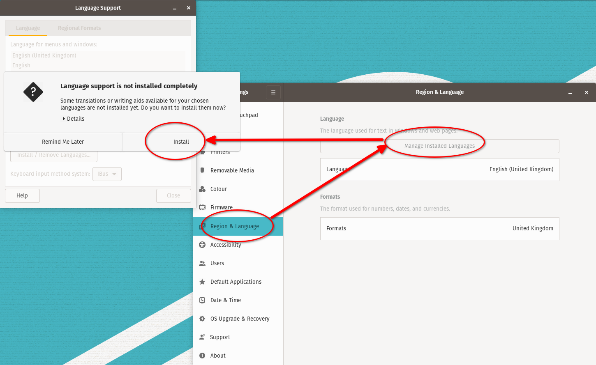

# Instalación de Linux (POP OS 20.04)

* Bajamos e instalamos con las [instrucciones oficiales](
https://support.system76.com/articles/install-pop/)
  * Usamos "_Full Disk Encryption_" con una clave distinta a la de login
* Entramos (en la UI gráfica) en **Settings** &rarr; **About** y configuramos el
**Device Name** con el nombre que le queremos poner al equipo (hostname)
* En **Settings** &rarr; **Region and Language** terminamos de instalar el
_Language Support_:



## Instalación paquetes básicos
```
# repositorio de drivers de System76
sudo apt-add-repository ppa:system76-dev/stable

# paquetes headless
sudo apt install build-essential subversion git vim openssh-server openssh-client

# paquetes UI grafica
sudo apt install gnome-tweaks synaptic thunderbird vim-gtk3
```
## Entorno `/home/baby`:
```
# backup de los archivos que vienen "de fábrica" (para que no falle el checkout)
mkdir .00-ENV-BACKUP
mv .bash* .profile .00-ENV-BACKUP

# hacemos checkout del entorno
svn checkout http://svn.ybab.net/baby/conf/baby/home_env/ .

# Copiamos archivos del cliente ssh 
cp ~/MOVEME_2_.ssh/* ~/.ssh

# Copiamos archivos del cliente gpg 
cp ~/MOVEME_2_.gnupg/* ~/.gnupg

# Copiamos archivos del cliente subversion 
cp ~/MOVEME_2_.subversion/* ~/.subversion
```
## _Tweaks_ de gnome shell
Abrir **Gnome Tweaks** y hacer algunos ajustes:


## `ksnip` para capturar pantallas (screenshots) 
La página oficial es la de [github](https://github.com/ksnip/ksnip).
En Pop OS la forma "oficial" de instalarlo es vía `flatpak`.
```
# instalar paquete flatpak
flatpak install flathub org.ksnip.ksnip
# crear una carpeta (dentro de ~/Pictures) para guardar las capturas
mkdir -pv ~/Pictures/Screenshots
```
Abrir la interfaz y cambiar algunas configuraciones (tocando `Alt+F7` o a través
del menú _Options_ &rarr; _Settings_):


En particular, **Capture save location and filename:**
`/home/baby/Pictures/Screenshots/$Y$M$D-$T.png`

___
<!-- LICENSE -->
___
<a rel="licencia" href="http://creativecommons.org/licenses/by-sa/4.0/deed.es">
</a>
<br /><br />
Este documento está licenciado en los términos de una <a rel="licencia"
href="http://creativecommons.org/licenses/by-sa/4.0/deed.es">
Licencia Atribución-CompartirIgual 4.0 Internacional de Creative Commons</a>.
<br /><br />
This document is licensed under a <a rel="license" 
href="http://creativecommons.org/licenses/by-sa/4.0/deed.en">
Creative Commons Attribution-ShareAlike 4.0 International License</a>.
<!-- END --> 
