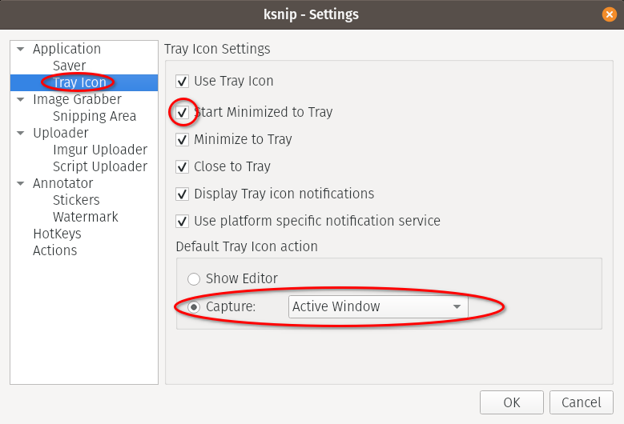
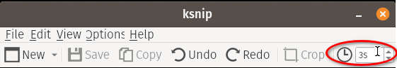

# Instalación de Linux (POP OS 20.04)

* Bajamos e instalamos con las [instrucciones oficiales](
https://support.system76.com/articles/install-pop/)
  * Usamos "_Full Disk Encryption_" con una clave distinta a la de login
* Entramos (en la UI gráfica) en **Settings** &rarr; **About** y configuramos el
**Device Name** con el nombre que le queremos poner al equipo (hostname)
* En **Settings** &rarr; **Region and Language** terminamos de instalar el
_Language Support_:


## Instalación paquetes básicos
```
# repositorio de drivers de System76
sudo apt-add-repository ppa:system76-dev/stable

# paquetes headless
sudo apt install build-essential subversion git vim openssh-server openssh-client

# paquetes UI grafica
sudo apt install gnome-tweaks synaptic thunderbird vim-gtk3 chromium chromium-l10n chromium-driver chromium-shell
```
## Entorno `/home/baby`:
```
# backup de los archivos que vienen "de fábrica" (para que no falle el checkout)
mkdir -pv ~/.00-ENV-BACKUP
mv -v ~/.bash* ~/.profile ~/.00-ENV-BACKUP

# hacemos checkout del entorno
svn checkout http://svn.ybab.net/baby/conf/baby/home_env/ .

# Copiamos archivos del cliente ssh 
cp -v ~/MOVEME_2_.ssh/* ~/.ssh
# Esto ya debería estar así, pero por si acaso:
chmod -v 700 ~/.ssh

# Autorizamos la conexión vía ssh con mi clave pública primaria
cp -v ~/.ssh/id_rsa.pub ~/.ssh/authorized_keys
chmod -v 644 ~/.ssh/authorized_keys

# Si el equipo es seguro, hay que agregarle el ~/.ssh/id_rsa desde otro equipo

# Copiamos archivos del cliente gpg 
cp -v ~/MOVEME_2_.gnupg/* ~/.gnupg

# Copiamos archivos del cliente subversion 
cp -v ~/MOVEME_2_.subversion/* ~/.subversion
```
## _Tweaks_ de gnome shell
Abrir **Gnome Tweaks** y hacer algunos ajustes:


## _Bookmarks_ para gnome shell
Esto en general se configura desde _Files_ o el navegador de carpetas y archivos
que sea, pero es más simple clavarlo directamente en el archivo de configuración
correspondiente:
```
mkdir -pv ~/Documents/ZZ-temp
cat >> ~/.config/gtk-3.0/bookmarks <<EOF
file:///home/baby/Documents/Cuentas Cuentas
file:///home/baby/Pictures/Screenshots Screenshots
file:///tmp /tmp
file:///home/baby/Documents/ZZ-temp ZZ-temp
EOF
```

## Extensiones de Gnome

La mayoría de las configuraciones que se podían hacer antes en Gnome Shell ahora
está en diversas extensiones que se instalan y configuran individualmente.

La página oficial de las extensiones es https://extensions.gnome.org/

Pop OS ya viene con algunas instaladas. Para activar y configurar las
extensiones instaladas hay que ir a https://extensions.gnome.org/local/

Para que eso funcione hay que instalar [esta extensión (del navegador)
](https://addons.mozilla.org/firefox/addon/gnome-shell-integration/) en Firefox
o [esta extensión
](https://chrome.google.com/webstore/detail/gnome-shell-integration/gphhapmejobijbbhgpjhcjognlahblep)
en Google Chrome o Chromium.

En [esta página de soporte de System76 (Pop OS!)
](https://support.system76.com/articles/customize-gnome/) hay recomendaciones de
varias extensiones.

Las que instalamos son las siguientes:

* [Dash to Dock](https://extensions.gnome.org/extension/307/dash-to-dock/) es un
_Dock_ estilo Mac para lanzar aplicaciones (se puede ubicar en la parte inferior 
o a los costados de la pantalla). Cambiar estas configuraciones:


* [Window List](https://extensions.gnome.org/extension/602/window-list/) es una
lista de ventanas abiertas en la parte inferior de la pantalla (como en el viejo
Gnome o MS Windows)
* [Lock Keys](https://extensions.gnome.org/extension/36/lock-keys/) muestra el
estado de las teclas `NumLock` y `CapsLock` en el panel
* [Desktop Icons NG (DING)
](https://extensions.gnome.org/extension/2087/desktop-icons-ng-ding/) agrega
íconos al escritorio
* [User Themes](https://extensions.gnome.org/extension/19/user-themes/) permite
cargar _themes_ del usuario desde `~/.themes/gnome-shell`
* [Sound Input & Output Device Chooser
](https://extensions.gnome.org/extension/906/sound-output-device-chooser/) 
muestra el listado de dispositivos de salida y entrada de sonido en el menú de
status debajo del control de volumen
* [Clock Override](https://extensions.gnome.org/extension/1206/clock-override/)
permite configurar el formato del reloj de la barra superior del Gnome Shell.
Los formatos soportados son [los de gtk
](https://docs.gtk.org/glib/method.DateTime.format.html). Un formato completito
puede ser `%a %e %b (%Y-%m-%d_%H:%M:%S) @%;@`
* [Extension List](https://extensions.gnome.org/extension/3088/extension-list/)
permite gestionar estas extensiones de Gnome desde el panel
* [Extension Update Notifier
](https://extensions.gnome.org/extension/1166/extension-update-notifier/)
muestra notificaciones cuando hay actualizaciones de las extensiones instaladas
* [Tray Icons: Reloaded
](https://extensions.gnome.org/extension/2890/tray-icons-reloaded/) vuelve a 
mostrar los íconos de la bandeja en el panel


## `ksnip` para capturar pantallas (screenshots) 
La página oficial es la de [github](https://github.com/ksnip/ksnip).
En Pop OS la forma "oficial" de instalarlo es vía `flatpak`.
```
# instalar paquete flatpak
flatpak install flathub org.ksnip.ksnip
# crear una carpeta (dentro de ~/Pictures) para guardar las capturas
mkdir -pv ~/Pictures/Screenshots
```
Abrir la interfaz y cambiar algunas configuraciones (tocando `Alt+F7` o a través
del menú _Options_ &rarr; _Settings_):




En particular, **Capture save location and filename:**
`/home/baby/Pictures/Screenshots/$Y$M$D-$T.png`

En la ventana principal también conviene agregar un _delay_ para la captura:


## Cliente de mail Mozilla Thunderbird

[Configurar Thunderbird](ConfigurarThunderbird.md)

## Foxit PDF Reader

[Instalar Foxit PDF Reader](ConfigurarFoxit.md)

___
<!-- LICENSE -->
___
<a rel="licencia" href="http://creativecommons.org/licenses/by-sa/4.0/deed.es">
</a>
<br /><br />
Este documento está licenciado en los términos de una <a rel="licencia"
href="http://creativecommons.org/licenses/by-sa/4.0/deed.es">
Licencia Atribución-CompartirIgual 4.0 Internacional de Creative Commons</a>.
<br /><br />
This document is licensed under a <a rel="license" 
href="http://creativecommons.org/licenses/by-sa/4.0/deed.en">
Creative Commons Attribution-ShareAlike 4.0 International License</a>.
<!-- END --> 
