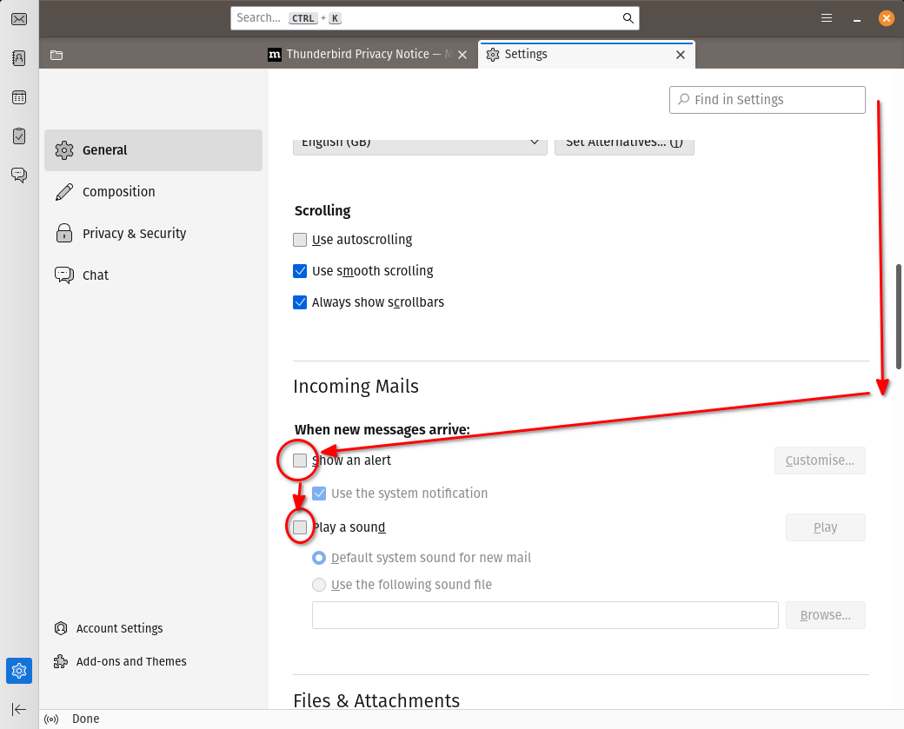
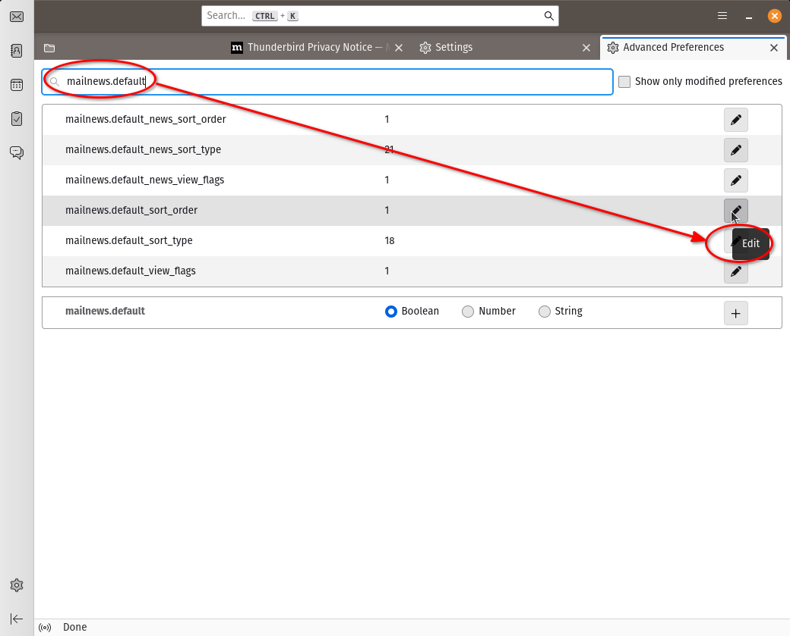
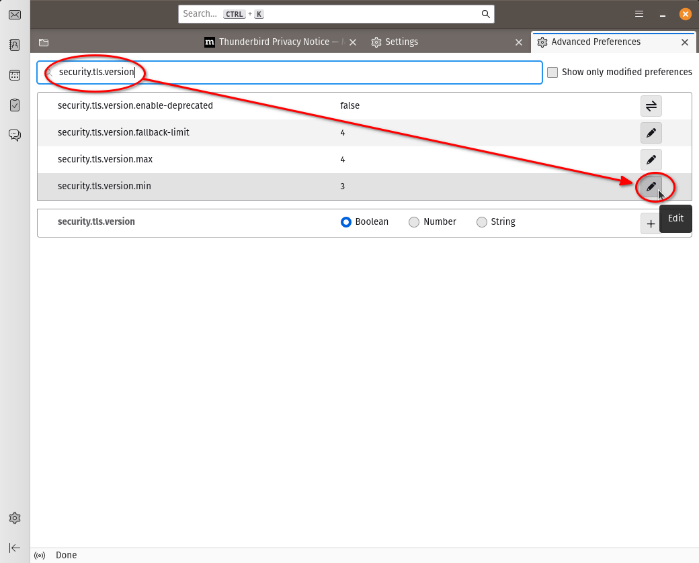
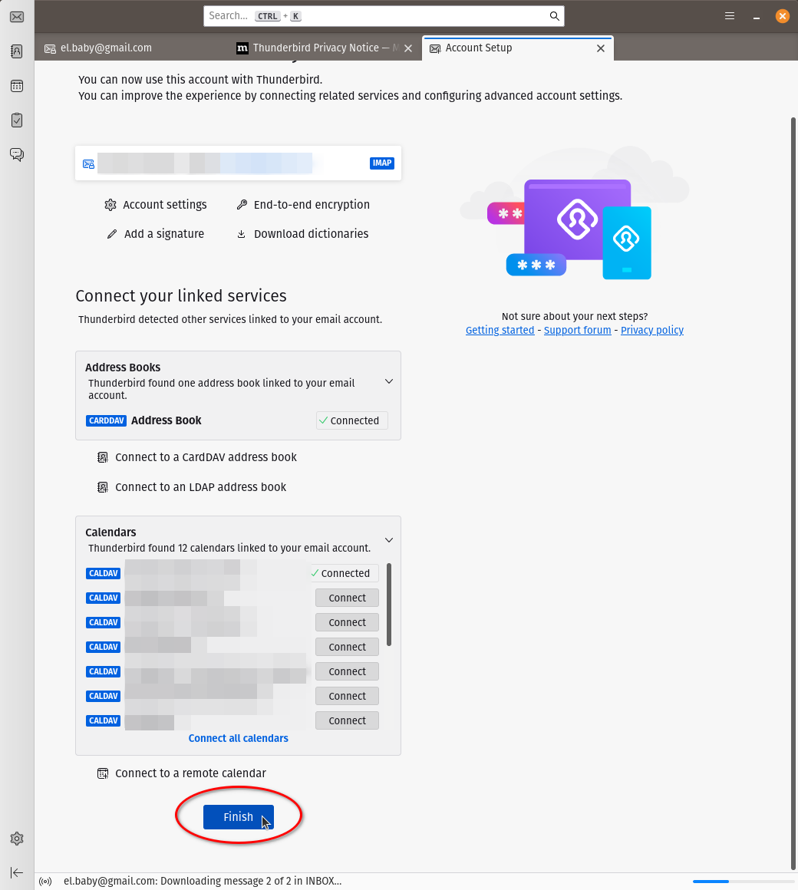

# Instalación y configuración del cliente de mail Mozilla Thunderbird

## Instalación

Instalar el thunderbird
```
sudo apt install thunderbird
```
Ahora vamos a hacer una configuración personalizada.

## Profile Manager

Para eso, lanzamos el _Profile Manager_ **antes** de arrancarlo por primera vez.
Desde una terminal (dentro del entorno gráfico), tipear:
```
thunderbird -ProfileManager
```
Esto va a lanzar el _Profile Manager_.

### Crear profile nuevo con nombre y carpeta en ubicación personalizada


A continuación, ofrece crear una nueva cuenta, pero cancelamos para configurar
algunas cosas _antes_ de crear la primera cuenta:


## Preferencias de correo electrónico





Utilizar **maildir** en lugar de **mbox** para las carpetas de mail:


Hacer que las carpetas abran por default con orden cronológico descendente (el
mail más nuevo arriba):



Este cambio sólo hay que hacerlo si nos vamos a conectar a un servidor que no
soporta versiones de TLS nuevas:



Configuraciones para la redacción de mensajes:


Para finalizar, cerramos el tab de preferencias:


## Configurar cuenta de correo de GMail


Utilizamos IMAP


Autenticarse con Google y permitir el acceso


Conectar libreta de direcciones y calendario de Google:




Configurar las preferencias del Calendario:


___
<!-- LICENSE -->
___
<a rel="licencia" href="http://creativecommons.org/licenses/by-sa/4.0/deed.es">
</a>
<br /><br />
Este documento está licenciado en los términos de una <a rel="licencia"
href="http://creativecommons.org/licenses/by-sa/4.0/deed.es">
Licencia Atribución-CompartirIgual 4.0 Internacional de Creative Commons</a>.
<br /><br />
This document is licensed under a <a rel="license" 
href="http://creativecommons.org/licenses/by-sa/4.0/deed.en">
Creative Commons Attribution-ShareAlike 4.0 International License</a>.
<!-- END --> 
