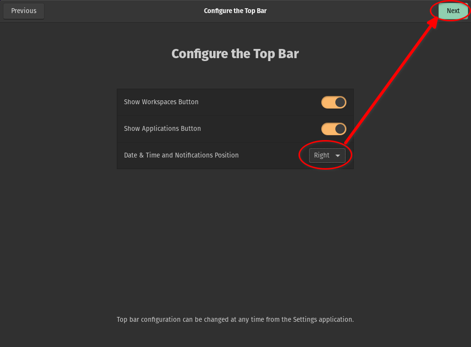

# Instalación de Linux (Pop! OS 22.04)

([acá está la versión anterior para Pop! OS 
20.04](DesktopBaby_PopOS-20.04.md))

* Bajamos e instalamos con las [instrucciones oficiales](
https://support.system76.com/articles/install-pop/)
  * Elegir "_Full Disk Encryption_" 
  * **Apagar** la opción "_Encryption password is the same as user account
password_"
  * Tipear la clave de encripción del disco y apretar el botón "**_Encrypt_**"

* En la ventana de bienvenida del instalador, seleccionar la opción "_Dock
doesn't extend to edges_" y apretar el botón "**_Next_**"


* En la ventana de configuración del Top Bar del instalador, en la opción "_Date
& Time and Notifications Position_" seleccionar "_Right_" y apretar el botón
"**_Next_**"



* En la ventana de configuración del aspecto (_Appearance_) del instalador,
seleccionar "_Light_" y apretar el botón "**_Next_**"


* En la ventana de configuración del huso horario (_Time Zone_) del instalador,
comenzar a escribir y seleccionar "_Buenos Aires, Argentina_" y apretar el botón
"**_Next_**"


* En la ventana de finalización del instalador, apretar el botón "**_Start Using
Pop!_OS_**"


## _Settings_ de gnome shell

* Entramos (en la UI gráfica) en **Settings** &rarr; **About** y configuramos el
**Device Name** con el nombre que le queremos poner al equipo (hostname)


* En **Settings** &rarr; **Region and Language** apretar el botón **_Manage
Installed Languages_** y terminar de instalar el _Language Support_:


* En la misma ventana, seleccionar **Regional Formats**, elegir el formato para
usar para números, fechas y monedas y apretar el botón **_Apply system-wide_**.


* En **Settings** &rarr; **Desktop** &rarr; **Background** elegir la imagen de
fondo


* En **Settings** &rarr; **Desktop** &rarr; **Dock** configurar las siguientes
opciones:
  * En **Dock Options** en la opción **Icon Click Action** seleccionar
"**_Launch, Minimize, or Preview Windows_**"
  * En **Dock Visibility** 
    * seleccionar **_Intelligently hide_**
    * en la opción **Show Dock on Display** seleccionar "**_All Displays_**"
  * En **Dock Size** seleccionar **_Small (36px)_**


* En **Settings** &rarr; **Desktop** &rarr; **Workspaces** en **Multi-monitor
Behavior** elegir **_Workspaces on Primary Display Only_**


* En **Settings** &rarr; **Privacy** &rarr; **Screen** poner **Blank Screen
Delay** en **_12 minutes_** y **Automatic Screen Lock Delay** en **_30
seconds_**


* En **Settings** &rarr; **Sound** en **System Volume** encender 
**_Over-Amplification_**


* En **Settings** &rarr; **Power** &rarr; **Power Saving Options** en
**Automatic Suspend** apagar **_Plugged In_** y en **Suspend & Power Button**
encender **_Show Battery Percentage_**


* En **Settings** &rarr; **Accessibility** &rarr; **Seeing** encender **_Large
Text_**


* En **Settings** &rarr; **Date & Time** poner **Time Format** en **_24-hour_**


## _Tweaks_ de gnome shell

En una ventana de terminal, instalamos **Gnome Tweaks** que permite configurar
algunas cosas que no están en las configuraciones generales (**_Settings_**) de
gnome shell:

```
sudo apt-get install gnome-tweaks
```

Abrir **Gnome Tweaks** para hacer ajustes que no están accesibles desde la
configuración estándar.

* En **Gnome Tweaks** &rarr; **Top Bar** &rarr; **Clock** encender **_Weekday_**
y **_Seconds_**


## Instalación paquetes básicos

```
# repositorio de drivers de System76 (esto ya debería estar)
#sudo apt-add-repository ppa:system76-dev/stable

# repositorio GitHub CLI
curl --fail --silent --show-error --location \
    https://cli.github.com/packages/githubcli-archive-keyring.gpg | \
    sudo tee /usr/share/keyrings/githubcli-archive-keyring.gpg >/dev/null
echo "deb [arch=$(dpkg --print-architecture) signed-by=/usr/share/keyrings/githubcli-archive-keyring.gpg] https://cli.github.com/packages stable main" |\
    sudo tee /etc/apt/sources.list.d/github-cli.list > /dev/null

# actualización de repositorios y de todo lo que ya está instalado
sudo apt-get update
sudo apt-get dist-upgrade

# paquetes headless
sudo apt-get install synaptic build-essential vim keychain tofrodos \
    net-tools tcptraceroute openssh-server openssh-client openvpn nmap \
    ucspi-tcp-ipv6 p7zip-full p7zip-rar git git-filter-repo gh grip subversion \
    direnv imagemagick

# paquetes UI grafica
sudo apt-get install gparted exfatprogs exfat-fuse libwmf0.2-7-gtk \
    network-manager-openvpn-gnome speedcrunch vim-gtk3 \
    gimp-help-en gimp-help-es gimp-data-extras gnome-sound-recorder \
    pavucontrol

# paquetes vía flatpak (sólo para el usuario)
flatpak remote-add --user --if-not-exists flathub \
    https://flathub.org/repo/flathub.flatpakrepo
flatpak install --user --assumeyes flathub com.github.tchx84.Flatseal \
    com.bitwarden.desktop org.keepassxc.KeePassXC org.ksnip.ksnip \
    org.telegram.desktop im.riot.Riot org.signal.Signal us.zoom.Zoom \
    com.mastermindzh.tidal-hifi com.spotify.Client org.pipewire.Helvum \
    org.audacityteam.Audacity com.stremio.Stremio com.calibre_ebook.calibre \
    org.mozilla.Thunderbird com.jgraph.drawio.desktop org.remmina.Remmina \
    org.kde.kpat 


# configuración de flatpak
flatpak --user config --set languages 'en;es'
# actualizacion de Locales
flatpak update --subpath=en,es org.gnome.Platform.Locale
```

* Configurar `vim` como el editor preferido del sistema:
```
sudo update-alternatives --set editor /usr/bin/vim.basic
```

## Entorno `/home/baby`:
```
# backup de los archivos que vienen "de fábrica" (para que no falle el checkout)
mkdir -pv ~/.00-ENV-BACKUP
mv -v ~/.bash* ~/.profile ~/.pam_environment ~/.vim* ~/.caff* ~/.gitconfig \
    ~/.hgrc ~/.msmtp* ~/.00-ENV-BACKUP

# hacemos checkout del entorno
svn checkout http://svn.ybab.net/baby/conf/baby/home_env/ .

# Si queremos usar LaTeX, descomentar la próxima línea que mantiene fonts
# para tener en ~/texmf
#svn checkout http://svn.ybab.net/baby/conf/baby/texmf

# creamos el ~/.bash_USUARIO
make .bash_${LOGNAME}

# Creamos el directorio ~/.ssh si no existe
mkdir -pv ~/.ssh
# Copiamos archivos del cliente ssh 
cp -v ~/MOVEME_2_.ssh/* ~/.ssh
# Esto ya debería estar así, pero por si acaso:
chmod -v 700 ~/.ssh

# Autorizamos la conexión vía ssh con mis claves públicas
cp -v /dev/null ~/.ssh/authorized_keys
for key in ed25519 ecdsa rsa ; do
  cat ~/.ssh/id_${key}.pub >> ~/.ssh/authorized_keys
done
chmod -v 644 ~/.ssh/authorized_keys

# Si el equipo es seguro, hay que agregarle los ~/.ssh/id_${key} desde 
# otro equipo

# Creamos el directorio ~/.gnupg si no existe
mkdir -pv ~/.gnupg
# Copiamos archivos del cliente gpg 
cp -v ~/MOVEME_2_.gnupg/* ~/.gnupg
# Cambiamos los permisos de los directorios y archivos en ~/.gnupg
find ~/.gnupg -type d -exec chmod 700 {} \;
find ~/.gnupg -type f -exec chmod 600 {} \;

# El directorio ~/.subversion se creó durante el svn checkout
# Copiamos archivos del cliente subversion 
cp -v ~/MOVEME_2_.subversion/* ~/.subversion
```

## _Bookmarks_ para gnome shell

Esto en general se configura desde _Files_ o el navegador de carpetas y archivos
que sea, pero es más simple clavarlo directamente en el archivo de configuración
correspondiente:
```
mkdir -pv ~/Documents/ZZ-temp ~/Pictures/Screenshots
cat >> ~/.config/gtk-3.0/bookmarks <<EOF
file:///home/baby/Documents/Cuentas.git Cuentas
file:///home/baby/Pictures/Screenshots Screenshots
file:///tmp /tmp
file:///home/baby/Documents/ZZ-temp ZZ-temp
EOF
```

## Extensiones de Gnome

La mayoría de las configuraciones que se podían hacer antes en Gnome Shell ahora
está en diversas extensiones que se instalan y configuran individualmente.

La página oficial de las extensiones es https://extensions.gnome.org/

Pop OS ya viene con algunas instaladas. Para activar y configurar las
extensiones instaladas hay que ir a https://extensions.gnome.org/local/

Para que eso funcione hay que instalar [esta extensión (del navegador)
](https://addons.mozilla.org/firefox/addon/gnome-shell-integration/) en Firefox
o [esta extensión
](https://chrome.google.com/webstore/detail/gnome-shell-integration/gphhapmejobijbbhgpjhcjognlahblep)
en Google Chrome o Chromium.

En [esta página de soporte de System76 (Pop OS!)
](https://support.system76.com/articles/customize-gnome/) hay recomendaciones de
varias extensiones.

Las que instalamos son las siguientes:

* [Lock Keys](https://extensions.gnome.org/extension/36/lock-keys/) muestra el
estado de las teclas `NumLock` y `CapsLock` en el panel
* [Sound Input & Output Device Chooser
](https://extensions.gnome.org/extension/906/sound-output-device-chooser/) 
muestra el listado de dispositivos de salida y entrada de sonido en el menú de
status debajo del control de volumen
* [Extension List](https://extensions.gnome.org/extension/3088/extension-list/)
permite gestionar estas extensiones de Gnome desde el panel
* [Tray Icons: Reloaded
](https://extensions.gnome.org/extension/2890/tray-icons-reloaded/) vuelve a 
mostrar los íconos de la bandeja en el panel

Otras que se pueden instalar:

* [Desktop Icons NG (DING)
](https://extensions.gnome.org/extension/2087/desktop-icons-ng-ding/) agrega
íconos al escritorio
* [User Themes](https://extensions.gnome.org/extension/19/user-themes/) permite
cargar _themes_ del usuario desde `~/.themes/gnome-shell`
* [Window List](https://extensions.gnome.org/extension/602/window-list/) es una
lista de ventanas abiertas en la parte inferior de la pantalla (como en el viejo
Gnome o MS Windows) - **OJO** si usamos el **Cosmic Dock** abajo, no se puede 
usar esta extensión porque se pisan

## Aplicaciones en el _Dock_

Estas son las aplicaciones que dejo configuradas en el _Dock_:


## Configuración de Gnome Terminal

Abrir Gnome Terminal, seleccionar el "botón de hamburguesa" (**≡**) y
seleccionar _Preferences_:


Seleccionar el perfil default llamado **_Pop_** e ir a **Colors**:


Apagar la opción **_Use transparency from system theme_**, encender la opción
**_Use transparent background_** y ajustar el _slider_ con la transparencia
deseada (usualmente alrededor de un 15% es razonable):


## Configuración de KeePassXC

Abrir KeePassXC y cambiar algunas configuraciones (tocando `Alt+,` o a través
del menú _Tools_ &rarr; _Settings_):


## Algunas cosas más

* [Instalar y configurar **ksnip** para capturar y editar screenshots](Ksnip.md)
* [Instalar y configurar **etckeeper** para trackear cambios en /etc](Etckeeper.md)
* [Instalar el navegador **Google Chrome**](GoogleChrome.md)
* [Habilitar procesamiento de archivos **PDF** en 
**ImageMagick**](../tips-tricks/imagemagick-pdf.md)
* [Instalar **Foxit PDF Reader**](Foxit.md)

## Cliente de mail Mozilla Thunderbird

[Configurar **Thunderbird**](ThunderbirdFlatpak.md)

También se puede [recuperar la configuración de un backup de los
perfiles](ThunderbirdBackupProfile.md)

___
<!-- LICENSE -->
___
<a rel="licencia" href="https://creativecommons.org/licenses/by-sa/4.0/deed.es">
</a>
<br /><br />
Este documento está licenciado en los términos de una <a rel="licencia"
href="https://creativecommons.org/licenses/by-sa/4.0/deed.es">
Licencia Atribución-CompartirIgual 4.0 Internacional de Creative Commons</a>.
<br /><br />
This document is licensed under a <a rel="license" 
href="https://creativecommons.org/licenses/by-sa/4.0/deed.en">
Creative Commons Attribution-ShareAlike 4.0 International License</a>.
<!-- END --> 
