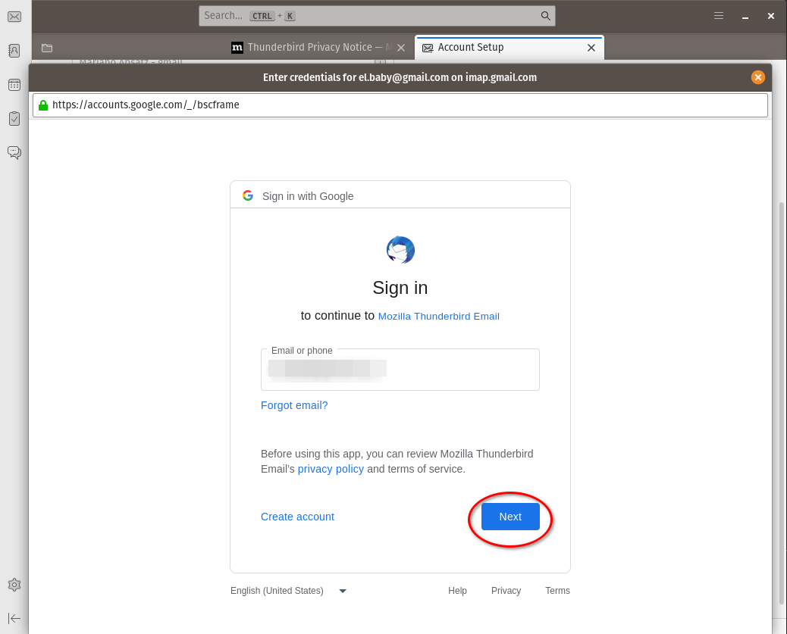
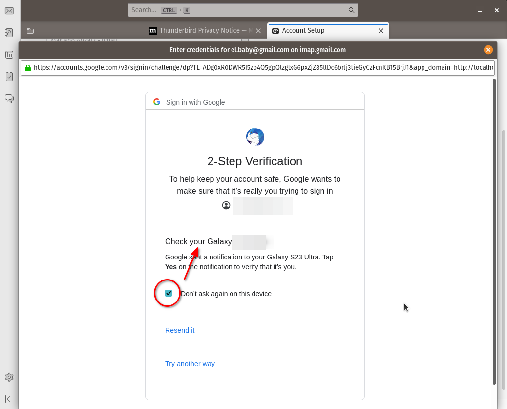

# Instalación y configuración del cliente de mail Mozilla Thunderbird (usando el paquete de Flatpak)

## Instalación

Instalar el thunderbird en modo usuario
```
flatpak install org.mozilla.Thunderbird
```
Ahora vamos a hacer una configuración personalizada.

## Profile Manager

Para eso, lanzamos el _Profile Manager_ **antes** de arrancarlo por primera vez.
Desde una terminal (dentro del entorno gráfico), tipear:
```
flatpak run --branch=stable --arch=x86_64 --env=LC_ALL=${LANG} --command=thunderbird --file-forwarding org.mozilla.Thunderbird -ProfileManager
```
Esto va a lanzar el _Profile Manager_.

### Crear profile nuevo con nombre y carpeta en ubicación personalizada


### Renombrar (y eventualmente mover) el directorio de perfil

Ahora vamos a renombrar el directorio del perfil para que quede fijo:
```
cd ~/.var/app/org.mozilla.Thunderbird/.thunderbird
NOMBREDIR=`echo *.baby`
mv -v ${NOMBREDIR} baby.profile
sed -i.BACKUP -e s/${NOMBREDIR}/baby.profile/g profiles.ini
```

Opcionalmente, lo podemos mover a otro filesystem (para que no ocupe petabytes
en el `home`):
```
# El ${DESTDIR} NO DEBE EXISTIR!! (y debe ser un path absoluto)
DESTDIR=/d/baby/thunderbird-profiles


cd ~/.var/app/org.mozilla.Thunderbird/
mv -v .thunderbird ${DESTDIR}
ln -sv ${DESTDIR} .thunderbird
```

## Configuraciones previas a la creación de la cuenta
Volvemos a arrancar el Thunderbird
```
flatpak run --branch=stable --arch=x86_64 --env=LC_ALL=${LANG} --command=thunderbird --file-forwarding org.mozilla.Thunderbird -ProfileManager
```


A continuación, ofrece crear una nueva cuenta, pero cancelamos para configurar
algunas cosas _antes_ de crear la primera cuenta:


## Configuraciones de correo electrónico

### Configuraciones Generales


Utilizar **maildir** en lugar de **mbox** para las carpetas de mail:


Hacer que las carpetas abran por default con orden cronológico descendente (el
mail más nuevo arriba):


#### OPCIONAL

Este cambio sólo hay que hacerlo si nos vamos a conectar a un servidor que no
soporta versiones de TLS nuevas:


### Configuraciones para la Redacción de Mensajes


Para finalizar, cerramos el tab de preferencias:


## Configurar cuenta de correo de GMail


Seleccionar IMAP


### Autenticarse con Google (OAuht) y permitir el acceso




A continuación, seleccionar el método de autenticación por 2° factor que
prefieras:




Una vez validado el 2° factor aparecerá el pedido de permisos necesarios:


### Conectar libreta de direcciones y calendario de Google


## Configuraciones de calendarios


___
<!-- LICENSE -->
___
<a rel="licencia" href="https://creativecommons.org/licenses/by-sa/4.0/deed.es">
</a>
<br /><br />
Este documento está licenciado en los términos de una <a rel="licencia"
href="https://creativecommons.org/licenses/by-sa/4.0/deed.es">
Licencia Atribución-CompartirIgual 4.0 Internacional de Creative Commons</a>.
<br /><br />
This document is licensed under a <a rel="license" 
href="https://creativecommons.org/licenses/by-sa/4.0/deed.en">
Creative Commons Attribution-ShareAlike 4.0 International License</a>.
<!-- END --> 
