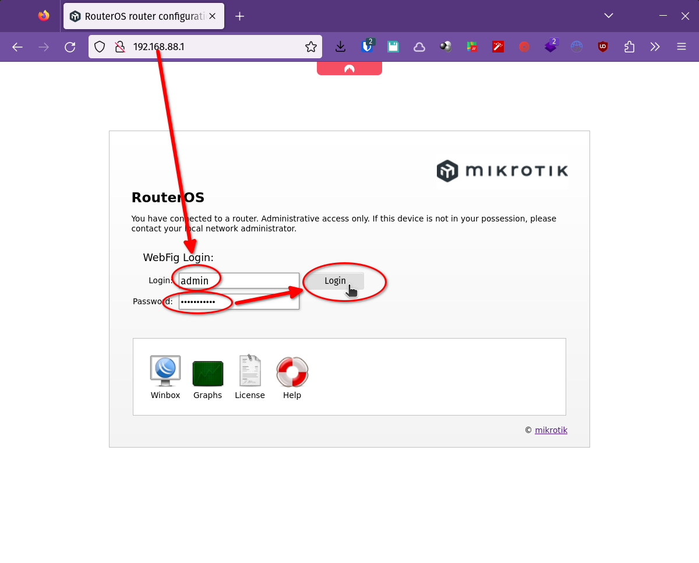

# Acceso al router para configuración

Ahora ya se puede ingresar al router para configurarlo utilizando el usuario
**admin** con la _password_ que se [configuró
anteriormente](IC_ResetearConfiguracion.md#password-del-administrador).

Existen tres formas de acceso:
* Vía web, se ingresa a la herramienta **WebFig**
* Con la GUI **WinBox**
* Utilizando la **consola**, ya sea vía ssh, o con el botón **Terminal** de
WebFig o la opción **New Terminal** de WinBox.

## Acceso web con WebFig

## Acceso GUI con WinBox

## Acceso CONSOLA con SSH

___
<!-- LICENSE -->
___

  
Este documento está licenciado en los términos de una <a rel="licencia"
href="https://creativecommons.org/licenses/by-sa/4.0/deed.es">
Licencia Atribución-CompartirIgual 4.0 Internacional de Creative Commons</a>.
  
This document is licensed under a <a rel="license" 
href="https://creativecommons.org/licenses/by-sa/4.0/deed.en">
Creative Commons Attribution-ShareAlike 4.0 International License</a>.
<!-- END --> 
