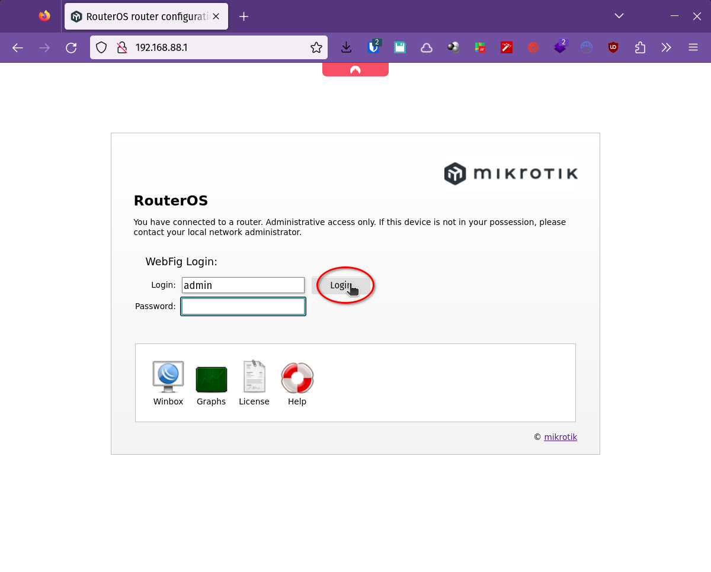

# Configuración por primera vez

Referencia: [Manual: Connecting to the
Router](https://help.mikrotik.com/docs/display/ROS/First+Time+Configuration#FirstTimeConfiguration-ConnectingtotheRouter)

Si el router es nuevo o está recién reseteado, en general se puede acceder a la
configuración a través de http://192.68.88.1 con usuario **admin** y **_sin 
ninguna clave_**.

## Conexión web a la IP por default

Hay que conectar un cable al puerto 2 (`ether2`) del router Mikrotik ya sea con
un cable directo desde la computadora o conectado al mismo switch.

Después, hay que configurar una dirección IP en la computadora. Primero,
averiguar el nombre del dispositivo de red en la computadora. Usamos el comando
`networkctl` de `systemd`:
```bash
$ networkctl list
WARNING: systemd-networkd is not running, output will be incomplete.

IDX LINK      TYPE     OPERATIONAL SETUP
  1 lo        loopback n/a         unmanaged
  2 enp57s0f1 ether    n/a         unmanaged
  3 wlp0s20f3 wlan     n/a         unmanaged
  4 docker0   bridge   n/a         unmanaged
```

Acá vemos 4 dispositivos. `lo` es la interfaz loopback, `enp57s0f1` es la
interfaz ethernet cableada (la que vamos a utilizar), `wlp0s20f3` es la interfaz
inalámbrica y `docker0` es un dispositivo virtual que se conecta a contenedores.

Ahora veamos las direcciones configuradas en la interfaz ethernet:
```bash
# poner en la variable ${DEV} el nombre de la interfaz ethernet
DEV=enp57s0f1

ip address show dev ${DEV}
```

La salida va a ser algo así:

```bash
$ ip address show dev ${DEV}
2: enp57s0f1: <BROADCAST,MULTICAST,UP,LOWER_UP> mtu 1500 qdisc fq_codel state UP group default qlen 1000
    link/ether 80:fa:5b:6a:36:ef brd ff:ff:ff:ff:ff:ff
    inet 192.168.1.101/24 brd 192.168.1.255 scope global dynamic noprefixroute enp57s0f1
       valid_lft 3442sec preferred_lft 3442sec
    inet6 fe80::d379:61d9:7d13:b375/64 scope link noprefixroute
       valid_lft forever preferred_lft forever
```
Acá vemos que la dirección IP de esta interfaz es **192.168.1.101**.

Vamos a configurar una dirección IP cualquiera dentro de la red
**192.168.88.0/24** (_excepto_ la 192.168.88.1 que es la que viene configurada
en el Mikrotik) y una ruta a la red 192.168.88.0/24 a través de esa interfaz.
Pongamos, por ejemplo, la 192.168.88.100:

```bash
# poner en la variable ${DEV} el nombre de la interfaz ethernet
DEV=enp57s0f1
IP=192.168.88.100
NET=192.168.88.0/24

sudo ip address add ${IP} dev ${DEV}
sudo ip route add ${NET} dev ${DEV} scope link src ${IP}
```

Ahora, la interfaz tiene, además de la dirección que ya tenía, la nueva
dirección y tenemos una ruta hacia esa red por esa interfaz:
```bash
$ ip address show dev ${DEV}
2: enp57s0f1: <BROADCAST,MULTICAST,UP,LOWER_UP> mtu 1500 qdisc fq_codel state UP group default qlen 1000
    link/ether 80:fa:5b:6a:36:ef brd ff:ff:ff:ff:ff:ff
    inet 192.168.1.101/24 brd 192.168.1.255 scope global dynamic noprefixroute enp57s0f1
       valid_lft 2518sec preferred_lft 2518sec
    inet 192.168.88.100/32 scope global enp57s0f1
       valid_lft forever preferred_lft forever
    inet6 fe80::d379:61d9:7d13:b375/64 scope link noprefixroute
       valid_lft forever preferred_lft forever

$ ip route show
default via 192.168.1.1 dev enp57s0f1 proto dhcp metric 100 
169.254.0.0/16 dev enp57s0f1 scope link metric 1000 
172.17.0.0/16 dev docker0 proto kernel scope link src 172.17.0.1 linkdown 
192.168.1.0/24 dev enp57s0f1 proto kernel scope link src 192.168.1.101 metric 100 
192.168.88.0/24 dev enp57s0f1 scope link src 192.168.88.100
```

Ahora ya se puede entrar en un navegador desde la computadora a
**http://192.168.88.1/**:



Al ingresar lo primero que pide es cambiar la clave, sin embargo lo que vamos a
hacer es borrar la configuración por default y dejar el router sin ninguna
configuración.

## Resetear _toda_ la configuración

Para eso ir a **System** => **Reset Configuration** y allí tildar la opción **No
Default Configuration** y luego presionar el botón **Reset Configuration**:


## Configuración mínima

Ahora el router no tiene ninguna configuración por lo cual no es accesible vía
web.

Es necesario conectarse por consola o [usar WinBox](WinBoxEnLinux.md) y
conectarse a nivel MAC (layer 2).

### Conectarse con WinBox

Arrancamos WinBox y, si sigue el cable conectado, vamos a ver el router con la
IP `0.0.0.0` e identidad (nombre) `MikroTik` (si hay otros dispositivos marca
MikroTik en la red, también estarán visibles):


### Password del administrador

Nuevamente, lo primero que hace es pedir que se configure la clave del usuario
`admin`. Ahora sí lo hacemos:


### Configurar la dirección IP

Finalmente, configuramos una dirección IP para el port `ether2` (que es donde
nos conectamos para administrarlo mientras lo configuramos).

Como ejemplo, vamos a configurar la misma dirección **192.168.88.1** que venía
por default (ya que tenemos el acceso configurado en la computadora), pero
podria utilizarse cualquier dirección privada. En caso de ser en otra red, hay
que asegurarse de configurar una dirección en esa red en la computadora que se
utilizará para configurar el router.

En WinBox, ir a **IP** => **Address**:


Presionar **`+`** y luego configurar **Address**: `192.168.88.1/24` e
**interface**: `ether2` y luego apretar el botón **OK**


___
<!-- LICENSE -->
___
<a rel="licencia" href="https://creativecommons.org/licenses/by-sa/4.0/deed.es">
</a>
<br /><br />
Este documento está licenciado en los términos de una <a rel="licencia"
href="https://creativecommons.org/licenses/by-sa/4.0/deed.es">
Licencia Atribución-CompartirIgual 4.0 Internacional de Creative Commons</a>.
<br /><br />
This document is licensed under a <a rel="license" 
href="https://creativecommons.org/licenses/by-sa/4.0/deed.en">
Creative Commons Attribution-ShareAlike 4.0 International License</a>.
<!-- END --> 
