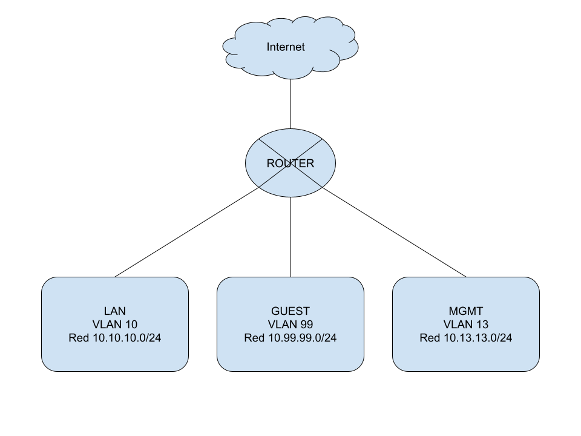

# Instalación completa de router MikroTik sin utilizar la configuración por _default_

Referencias:
* [Manual oficial de
RouterOS](https://help.mikrotik.com/docs/display)
* [Viejo manual oficial en formato
mediawiki](https://wiki.mikrotik.com/wiki/Manual:TOC) (algunas cosas se supone
que todavía no se migraron al nuevo formato)

## Esquema de la red

Vamos a crear 3 VLANs, cada una con una subred /24:

* **LAN** Esta va a ser la red por default, donde se conectan los dispositivos
cableados (computadoras de escritorio, televisores, etc), y también habrá una
red wifi en 2.4Ghz y otra en 5Ghz sobre esta VLAN para dispositivos inalámbricos
propios.
  * Esta red utilizará la **VLAN 10**
  * Esta red utilizará la subred **10.10.10.0/24**
* **GUEST** Esta va a ser la red wifi para "invitados". Sólo se dará salida a
internet y _no_ tendrá acceso al resto de la casa.
  * Esta red utilizará la **VLAN 99**
  * Esta red utilizará la subred **10.99.99.0/24**
* **MGMT** Esta va a ser la red para administrar los routers y APs. Sólo tendrá
acceso controlado desde LAN y no tendrá salida a internet.
  * Esta red utilizará la **VLAN 13**
  * Esta red utilizará la subred **10.13.13.0/24**

## Preparación inicial

Referencia: [Manual: Getting started / First Time
Configuration](https://help.mikrotik.com/docs/display/ROS/First+Time+Configuration)

* Lo primero que vamos a hacer es [resetear por completo la configuración del
router](IC_ResetearConfiguracion.md).

* Luego tendremos [tres formas de acceso al router](IC_Acceso.md)

* Vamos a [proteger el router](IC_Segurizar.md)

___
<!-- LICENSE -->
___

  
Este documento está licenciado en los términos de una <a rel="licencia"
href="https://creativecommons.org/licenses/by-sa/4.0/deed.es">
Licencia Atribución-CompartirIgual 4.0 Internacional de Creative Commons</a>.
  
This document is licensed under a <a rel="license" 
href="https://creativecommons.org/licenses/by-sa/4.0/deed.en">
Creative Commons Attribution-ShareAlike 4.0 International License</a>.
<!-- END --> 
