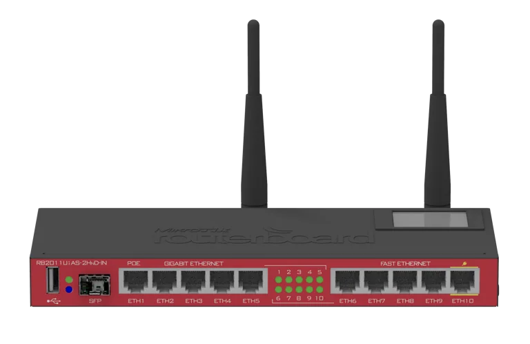
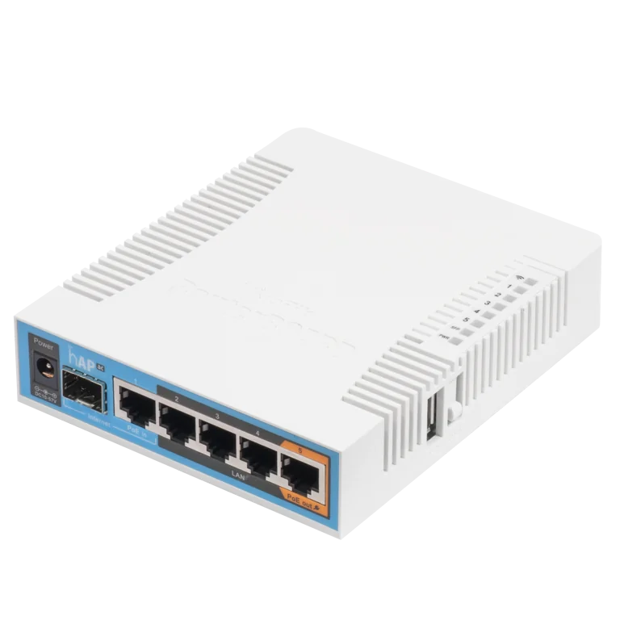
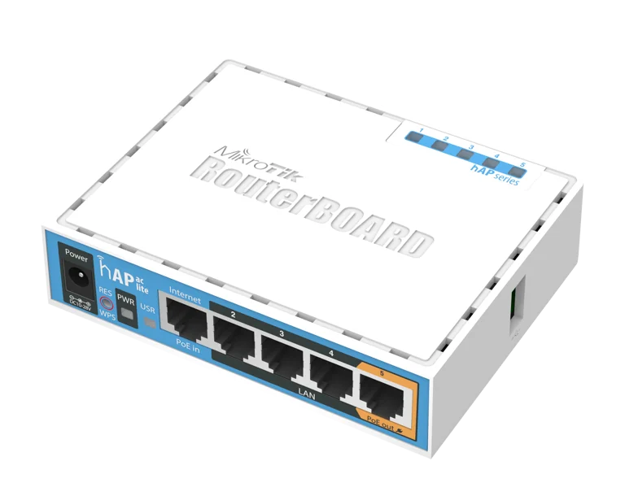

## RB2011UiAS-2HnD

* [Tech specs](https://mikrotik.com/product/RB2011UiAS-2HnD-IN)
* [Board tech specs](https://mikrotik.com/product/RB2011UiAS-2HnD)
* Switch chip
  * Atheros8327 (puertos ether1-ether5 y sfp1)
  * Atheros8227 (puertos ether6-ether10)

## hAP ac - RB962UiGS-5HacT2HnT

       

* [Tech specs](https://mikrotik.com/product/RB962UiGS-5HacT2HnT)
* Switch chip: QCA8337

## hAP ac lite - RB952Ui-5ac2nD

       

* [Tech specs](https://mikrotik.com/product/RB952Ui-5ac2nD)
* Switch chip: Atheros8227

