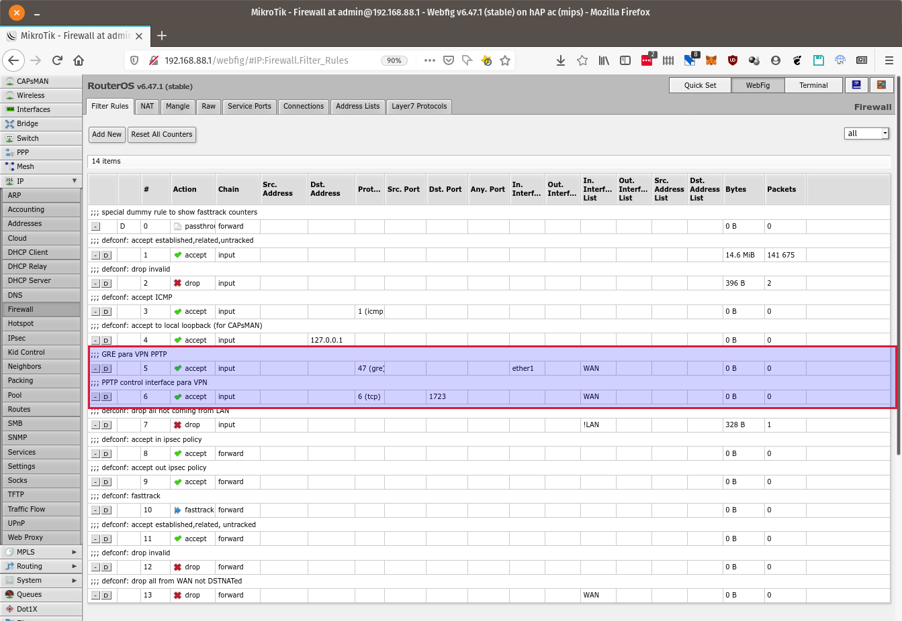

# Crear un servidor de VPN para acceso remoto usando PPTP

**Nota**: Si bien esto es lo más simple, PPTP no es seguro. Se recomienda usar 
[L2TP con IPsec](VPN-L2TP+IPsec-SERVER.md).

# Índice
* [Crear el perfil para PPTP](#crear-el-perfil-para-pptp)
* [Configurar el servidor PPTP](#configurar-el-servidor-pptp)
* [Habilitar el servicio PPTP](#habilitar-el-servicio-pptp)
* [Configurar la conectividad el acceso a los equipos conectados a la LAN](
#configurar-la-conectividad-el-acceso-a-los-equipos-conectados-a-la-lan)
* [Configurar el firewall para permitir la conexión y el tráfico desde la VPN](
#configurar-el-firewall-para-permitir-la-conexión-y-el-tráfico-desde-la-vpn)
  * [Agregar regla que permita túneles GRE](
#agregar-regla-que-permita-túneles-gre)
  * [Agregar regla que permita conexión a la interfaz de control de PPTP](
#agregar-regla-que-permita-conexión-a-la-interfaz-de-control-de-pptp)
  * [Mover las nuevas reglas del firewall a la posición correcta](
#mover-las-nuevas-reglas-del-firewall-a-la-posición-correcta)
* [Crear usuarios para acceso remoto](#crear-usuarios-para-acceso-remoto)
* [Cómo conectarse](#cómo-conectarse)

___
## Crear el perfil para PPTP

Ir a **PPP** :arrow_right: **Profiles** :arrow_right: **Add New**

Configurar los siguientes valores: <a name="edit-profile" />

* **Name**: Elegir un nombre para el perfil (lo usaremos internamente [abajo](
#configurar-el-servidor-pptp)
* **Local Address**: Poner la dirección IP del router en la red local (el 
_default gateway_ entregado por el Mikrotik a los clientes DHCP)
* **Remote Address**: Poner el pool de direcciones IP del bridge (se puede 
poner un pool distinto al que se usa para la LAN, pero, para simplicidad, _debe_ 
estar en la misma red). También se puede poner una dirección IP fija, pero sólo 
podrá establecerse una conexión por vez
* **Bridge**: El bridge que se usa en la LAN
* **Change TCP MSS**: Ponerlo en **yes**
* **Use Encryption**: Ponerlo en **yes**

Una vez realizado, presionar el botón **OK**.

___
## Configurar el servidor PPTP

Ir a **PPP** :arrow_right: **Interface** :arrow_right: **PPTP Server** 

Configurar los siguientes valores:

* **Enabled**: Encenderlo para habilitar la interfaz PPTP
* **Default Profile**: Elegir el nombre del perfil definido [arriba](
#user-content-edit-profile)
* **Authentication**: Opcionalmente, se pueden habilitar todos los métodos (por 
default vienen **mschap2** y **mschap1** que son los más utilizados)

Una vez realizado, presionar el botón **OK**.

___
## Habilitar el servicio PPTP

Ir a **PPP** :arrow_right: **Interface** :arrow_right: **New** :arrow_right: 
**PPTP Server Binding** 

Configurar los siguientes valores

* **Enabled**: (ya debería estar encendido)
* **Name**: Elegir un nombre para el servicio
* **User**: Dejarlo **en blanco**

Una vez realizado, presionar el botón **OK**.

Ya está creado el servicio.

___
## Configurar la conectividad el acceso a los equipos conectados a la LAN

Ir a **Interfaces** y seleccionar el bridge asociado a la LAN (en general, es el 
único bridge que hay):

Agregar la siguiente configuración:

* **ARP**: Seleccionar **proxy-arp**

para que los equipos de la VPN vean a los de la LAN y viceversa.

Una vez realizado, presionar el botón **OK**.

___
## Configurar el firewall para permitir la conexión y el tráfico desde la VPN

Ir a **IP** :arrow_right: **Firewall** :arrow_right: **Filter Rules** 
:arrow_right: **Add New** (para cada una de las siguientes reglas)

### Agregar regla que permita túneles GRE

(no estoy seguro de que _esta_ haga falta)

Configurar los siguientes datos:

* **Chain**: Seleccionar **Input**
* **Protocol**: Seleccionar **gre**
* **In Interface List**: Seleccionar **WAN** (o la lista donde está la interfaz 
que se conecta a _internet_ con una dirección pública)

En versiones viejas de _RouterOS_ que no tienen la opción **In Interface List** 
poner:
* **In Interface**: Seleccionar **ether1** (o el nombre que tenga la interfaz 
que se conecta a _internet_ con una dirección pública)

### Agregar regla que permita conexión a la interfaz de control de PPTP

Configurar los siguientes datos:

* **Chain**: Seleccionar **Input**
* **Protocol**: Seleccionar **6 (tcp)**
* **Dst. Port**: Seleccionar **1723** (pptp control interface)
* **In Interface List**: Seleccionar **WAN** (o la lista donde está la interfaz 
que se conecta a _internet_ con una dirección pública)

En versiones viejas de _RouterOS_ que no tienen la opción **In Interface List** 
poner:
* **In Interface**: Seleccionar **ether1** (o el nombre que tenga la interfaz 
que se conecta a _internet_ con una dirección pública)

### Mover las nuevas reglas del firewall a la posición correcta

Las dos reglas creadas recién se agregaron _al final_ del listado.

Hay que _moverlas_ para que quedan _arriba_ de la regla que hace **drop** en la 
chain **input** que viene de las interfaces que no están en la LAN.

Una vez reordenadas las reglas, el firewall queda así:

___
## Crear usuarios para acceso remoto

Ir a **PPP** :arrow_right: **Secrets** :arrow_right: **Add New** (para cada 
usuario al que le querramos crear una cuenta de acceso remoto)

Configurar los siguientes valores

* **Enabled**: (ya debería estar encendido)
* **Name**: Poner el nombre de usuario (con el que el usuario se va a loguear 
remotamente a la red)
* **Password**: Poner una clave para el usuario (con el que el usuario se va a 
loguear remotamente a la red - debería ser segura)
* **Service**: Se puede seleccionar **any** para que el mismo usuario pueda 
entrar por cualquier servicio, o ser más específicos y poner **pptp**
* **Profile**: Elegir el nombre del perfil definido [arriba](
#user-content-edit-profile)

Así queda el listado de usuarios con dos usuarios creados:

___
## Cómo conectarse

Los datos necesarios para conectarse son:

* **Gateway**: Es la dirección IP o el nombre DNS de la interfaz del router 
conectada a _internet_ (si la dirección es dinámica conviene utilizar algún 
servicio de DNS dinámico que se pueda actualizar cada vez que se modifica la 
dirección IP pública - ver [dynDNS](dynDNS.md))
* **User**: Un nombre de usuario creado [arriba](
#crear-usuarios-para-acceso-remoto)
* **Password**: La clave correspondiente a ese usuario
* **NT Domain**: No poner nada

___
<!-- LICENSE -->
___

  
Este documento está licenciado en los términos de una <a rel="licencia"
href="https://creativecommons.org/licenses/by-sa/4.0/deed.es">
Licencia Atribución-CompartirIgual 4.0 Internacional de Creative Commons</a>.
  
This document is licensed under a <a rel="license" 
href="https://creativecommons.org/licenses/by-sa/4.0/deed.en">
Creative Commons Attribution-ShareAlike 4.0 International License</a>.
<!-- END --> 
