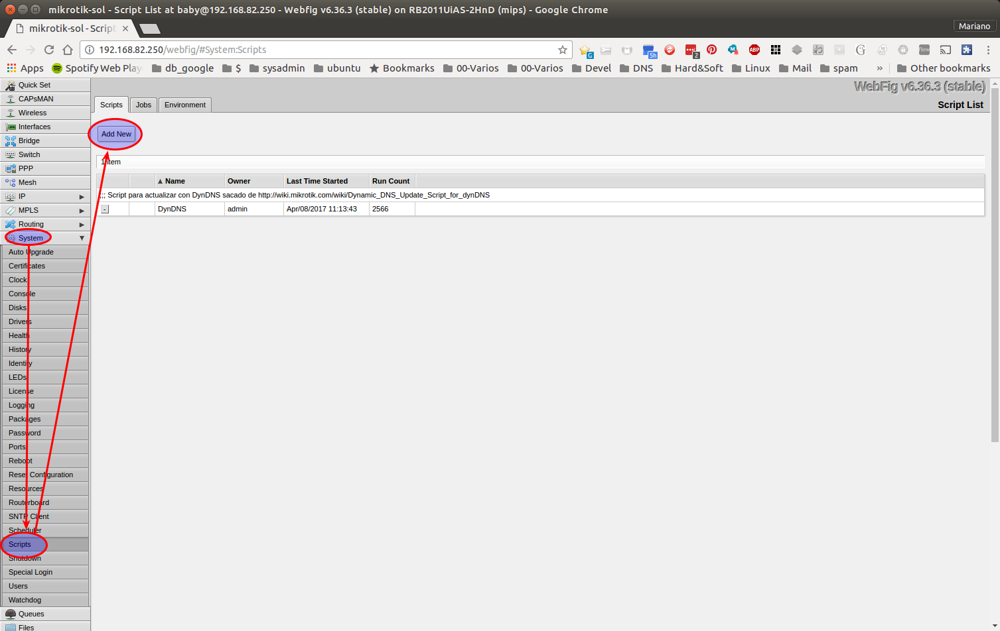
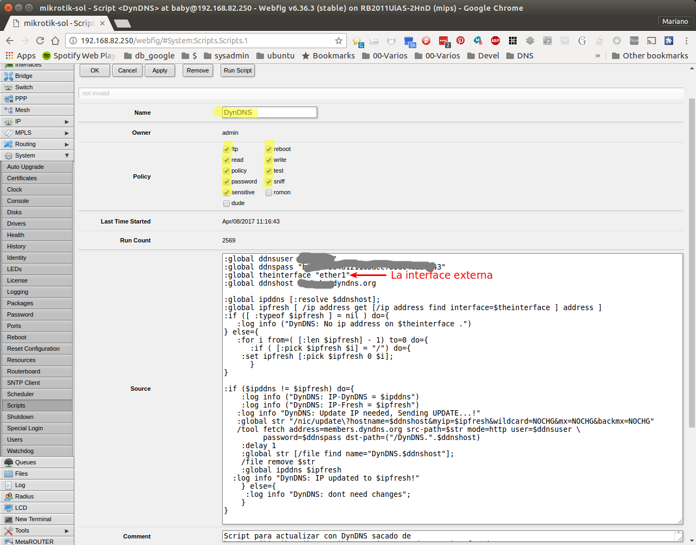
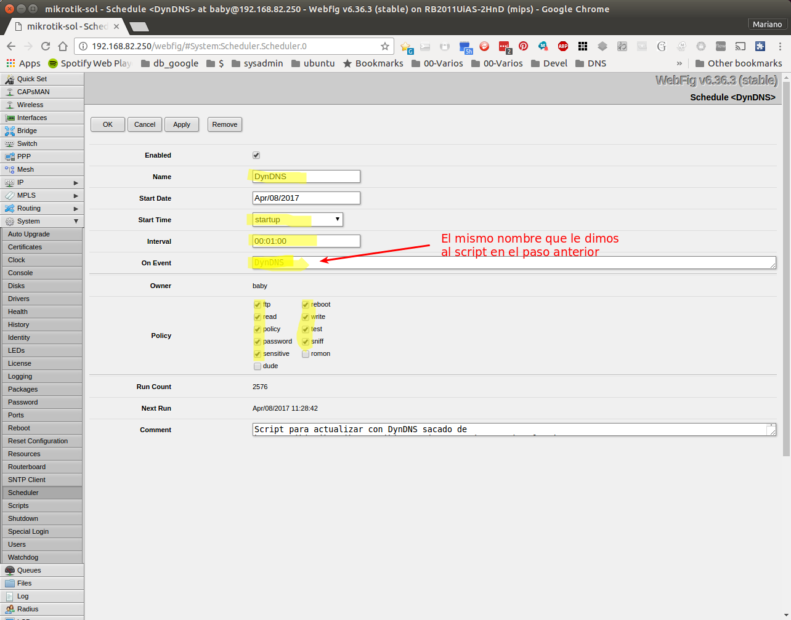

# Actualizar nombre DNS dinámico con dynDNS desde un router Mikrotik (usando webfig)

Basado en https://wiki.mikrotik.com/wiki/Dynamic_DNS_Update_Script_for_dynDNS 
(modificado para que funcione con RouterOS más nuevo y para no poner la password 
si no el _updater client key_ de dyn.com)

## Crear un nuevo script



Ponerle el nombre al script (en el ejemplo **DynDNS**) y verficar que estén 
seteadas todas las **Policy** que están marcadas en amarillo.

Copiar el texto (que está [más abajo](#fuente-del-script)) y pegarlo en la 
ventana **_Source_**.





## Crear un nuevo scheduler

Para que el script se ejecute regularmente, hay que agregar el sheduler


En **Start Time** poner **_startup_** para que comience a ejecutarse al bootear.

En **Interval** poner cada cuánto tiempo debería ejecutarse (acá está una vez 
por minuto). El script no hace nada si no cambió la dirección IP de la interfaz 
WAN.

Asegurarse de que el nombre del script (que va en **On Event**) es idéntico al 
que definimos arriba.



## Fuente del script

Los valores enmarcados en "<" y ">" hay que reemplazarlo por los datos de la 
cuenta en dyn.com y el nombre de la interfaz externa (WAN) del Mikrotik

```
:global ddnsuser "<nombre_de_usuario_en_dyn.com>"
:global ddnspass "<el_updater_client_key_en_dyn.com>"
:global theinterface "<la_interfaz_externa_del_mikrotik>"
:global ddnshost <el_nombre_de_host_en_dyn.com>
:global ipddns [:resolve $ddnshost];
:global ipfresh [ /ip address get [/ip address find interface=$theinterface ] address ]
:if ([ :typeof $ipfresh ] = nil ) do={
   :log info ("DynDNS: No ip address on $theinterface .")
} else={
   :for i from=( [:len $ipfresh] - 1) to=0 do={
      :if ( [:pick $ipfresh $i] = "/") do={
         :set ipfresh [:pick $ipfresh 0 $i];
      }
   }

   :if ($ipddns != $ipfresh) do={
   :log info ("DynDNS: IP-DynDNS = $ipddns")
   :log info ("DynDNS: IP-Fresh = $ipfresh")
   :log info "DynDNS: Update IP needed, Sending UPDATE...!"
   :global str "/nic/update\?hostname=$ddnshost&myip=$ipfresh&wildcard=NOCHG&mx=NOCHG&backmx=NOCHG"
   /tool fetch address=members.dyndns.org src-path=$str mode=http user=$ddnsuser \
         password=$ddnspass dst-path=("/DynDNS.".$ddnshost)
   :delay 1
   :global str [/file find name="DynDNS.$ddnshost"];
   /file remove $str
   :global ipddns $ipfresh
   :log info "DynDNS: IP updated to $ipfresh!"
   } else={
      :log info "DynDNS: dont need changes";
   }
}
```

___
<!-- LICENSE -->
___
<a rel="licencia" href="http://creativecommons.org/licenses/by-sa/4.0/deed.es">
</a>
<br /><br />
Este documento está licenciado en los términos de una <a rel="licencia"
href="http://creativecommons.org/licenses/by-sa/4.0/deed.es">
Licencia Atribución-CompartirIgual 4.0 Internacional de Creative Commons</a>.
<br /><br />
This document is licensed under a <a rel="license" 
href="http://creativecommons.org/licenses/by-sa/4.0/deed.en">
Creative Commons Attribution-ShareAlike 4.0 International License</a>.
<!-- END --> 
