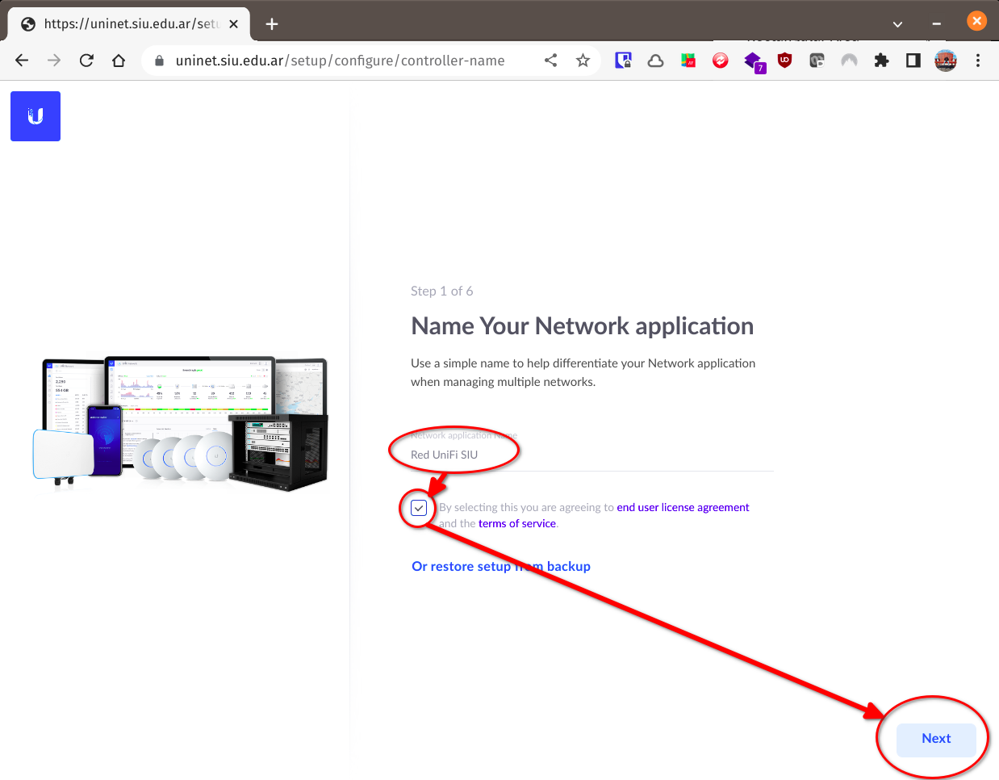
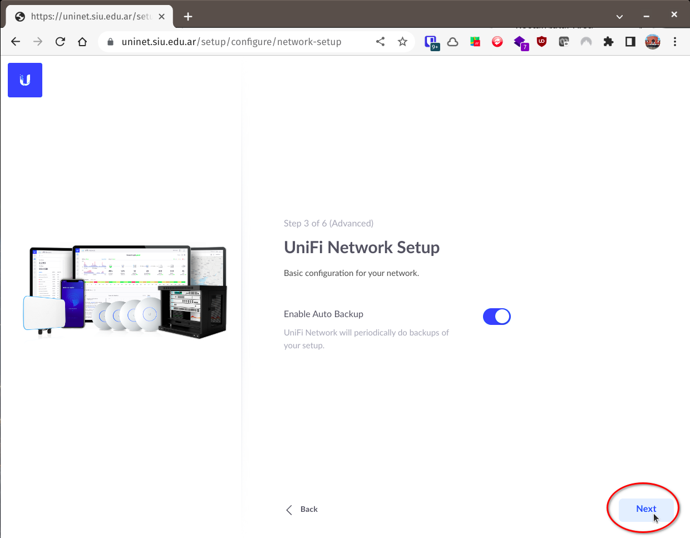
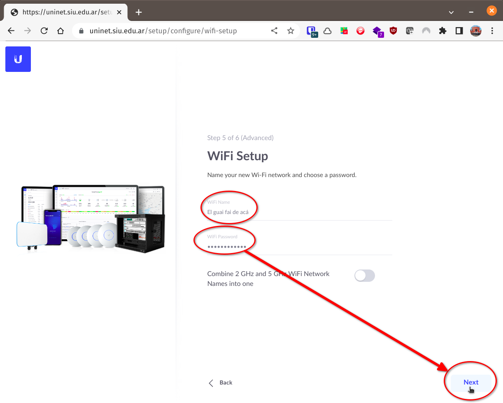
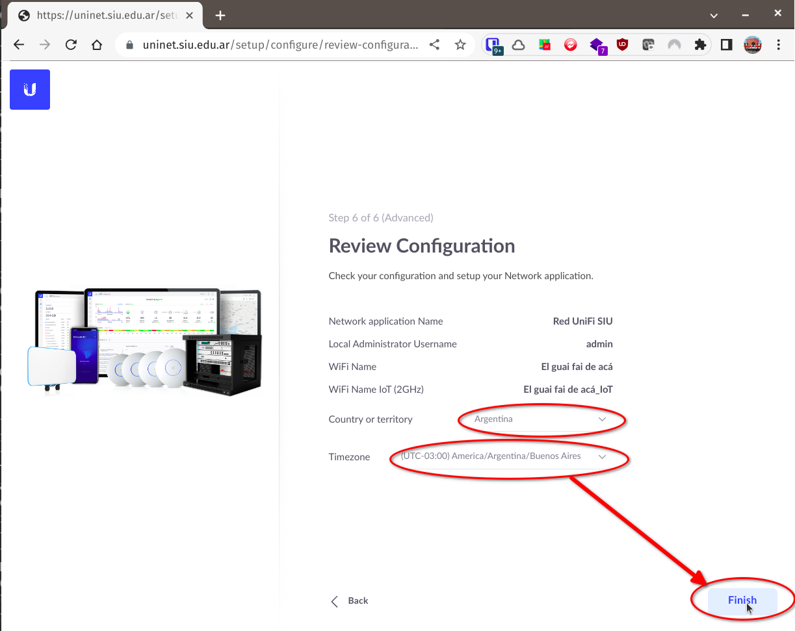

Estas son instrucciones para instalar [UniFi 
Network](https://help.ui.com/hc/en-us/categories/6583256751383-UniFi-Network)
(antes llamado _UniFi Controller_) en [modo _self 
hosted_](https://help.ui.com/hc/en-us/articles/220066768-UniFi-How-to-Install-and-Update-via-APT-on-Debian-or-Ubuntu)
en Debian 11 (Bullseye).

## Repositorios y claves

Obtener las claves públicas con las que están firmados los paquetes y 
repositorios y ponerlas en `/usr/share/keyrings/unifi-archive-keyring.gpg`,
`/usr/share/keyrings/mongodb36-archive-keyring.gpg` y 
`/usr/share/keyrings/bellsoft-archive-keyring.gpg`:

```
curl --location https://dl.ui.com/unifi/unifi-repo.gpg | gpg --dearmor | sudo tee /usr/share/keyrings/unifi-archive-keyring.gpg > /dev/null
curl --location https://www.mongodb.org/static/pgp/server-3.6.asc | gpg --dearmor | sudo tee /usr/share/keyrings/mongodb36-archive-keyring.gpg > /dev/null
curl --location https://download.bell-sw.com/pki/GPG-KEY-bellsoft | gpg --dearmor | sudo tee /usr/share/keyrings/bellsoft-archive-keyring.gpg > /dev/null
```

Poner el repositorio de UniFi en un archivo 
`/etc/apt/sources.list.d/unifi.list`, el de mongodb en 
`/etc/apt/sources.list.d/mongodb.list` y el de Bellsoft (Oracle clone) Java 8 en 
`/etc/apt/sources.list.d/bellsoft-java.list:

```
sudo tee /etc/apt/sources.list.d/unifi.list <<EOF
# https://help.ui.com/hc/en-us/articles/220066768-UniFi-Network-Updating-Third-Party-non-Console-UniFi-Network-Applications-Linux-Advanced-#1
deb [arch=amd64 signed-by=/usr/share/keyrings/unifi-archive-keyring.gpg] https://www.ui.com/downloads/unifi/debian stable ubiquiti
EOF

sudo tee /etc/apt/sources.list.d/mongodb.list <<EOF
# Los repos de MongoDB 3.6 sólo están para Stretch (ni Buster ni Bullseye)
deb [arch=amd64 signed-by=/usr/share/keyrings/mongodb36-archive-keyring.gpg] http://repo.mongodb.org/apt/debian stretch/mongodb-org/3.6 main
EOF

sudo tee /etc/apt/sources.list.d/bellsoft-java.list <<EOF
# https://bell-sw.com/pages/repositories/#apt
deb [arch=amd64 signed-by=/usr/share/keyrings/bellsoft-archive-keyring.gpg] https://apt.bell-sw.com/ stable main
EOF
```

Actualizar los datos de los repositorios:

```
sudo apt update
```

## Instalación

Instalar Bellsoft Java 8 y UniFi Network
```
sudo apt-get install bellsoft-java8 unifi
```

Configurar el `$JAVA_HOME` en UniFi para que encuentre el Java 8 de Bellsoft:
```
sudo tee /etc/default/unifi <<EOF
JAVA_HOME=/usr/lib/jvm/bellsoft-java8-amd64
EOF
```

Arrancar la aplicación:
```
sudo systemctl start unifi.service
```

Los logs de control (arranque/parada) de la aplicación se pueden ver con
```
sudo journalctl -u 'unifi' -e
```

Los logs del servidor se mantienen en **`/var/log/unifi`**.

Los datos del servidor se almacenan en **`/var/lib/unifi`**.

Para usar la aplicación hay que ir a `https://<IP-DEL-EQUIPO>:8443` (Ubiquiti
recomienda utilizar **Chrome**).

Esto va a dar un **ERROR SSL** ya que el certificado que tiene la aplicación es
autofirmado.

Se puede instalar un [Caddy](/Caddy) para usar de proxy reverso con 
certificados obtenidos vía LetsEncrypt.

## Setup inicial

Al entrar por primera vez hay que crear la cuenta de administrador y configurar
la red:

### Nombre global de la red



### Pasar a setup avanzado


### Acceso remoto y local





### Setup de WiFi



### Revisar configuración inicial




___
<!-- LICENSE -->
___
<a rel="licencia" href="http://creativecommons.org/licenses/by-sa/4.0/deed.es">
</a>
<br /><br />
Este documento está licenciado en los términos de una <a rel="licencia"
href="http://creativecommons.org/licenses/by-sa/4.0/deed.es">
Licencia Atribución-CompartirIgual 4.0 Internacional de Creative Commons</a>.
<br /><br />
This document is licensed under a <a rel="license" 
href="http://creativecommons.org/licenses/by-sa/4.0/deed.en">
Creative Commons Attribution-ShareAlike 4.0 International License</a>.
<!-- END --> 
