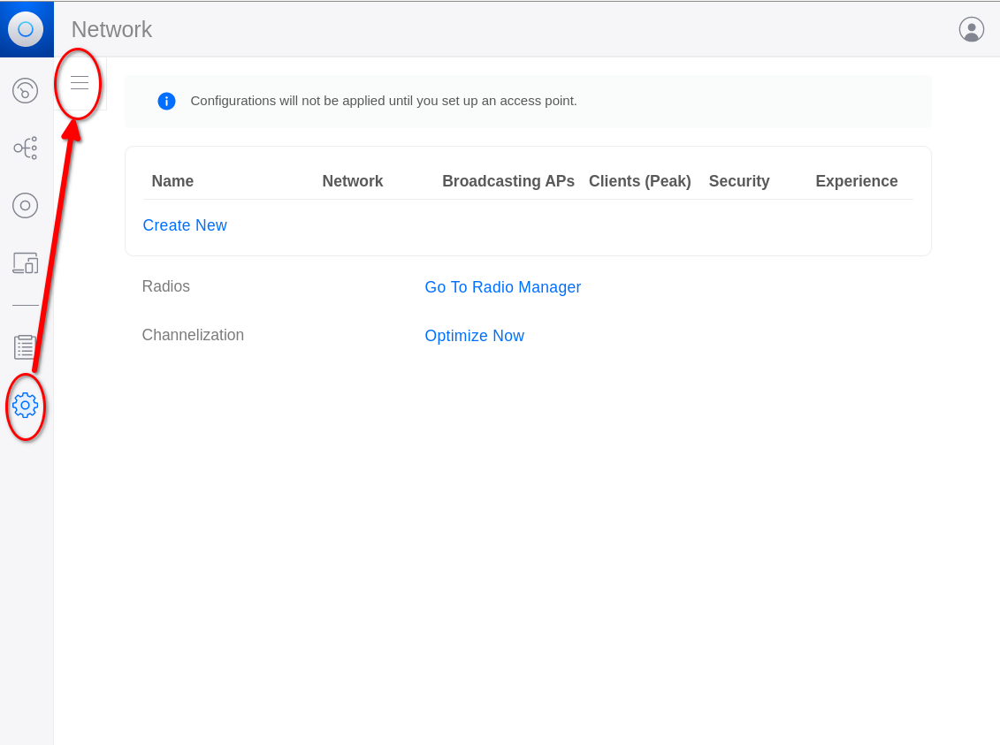
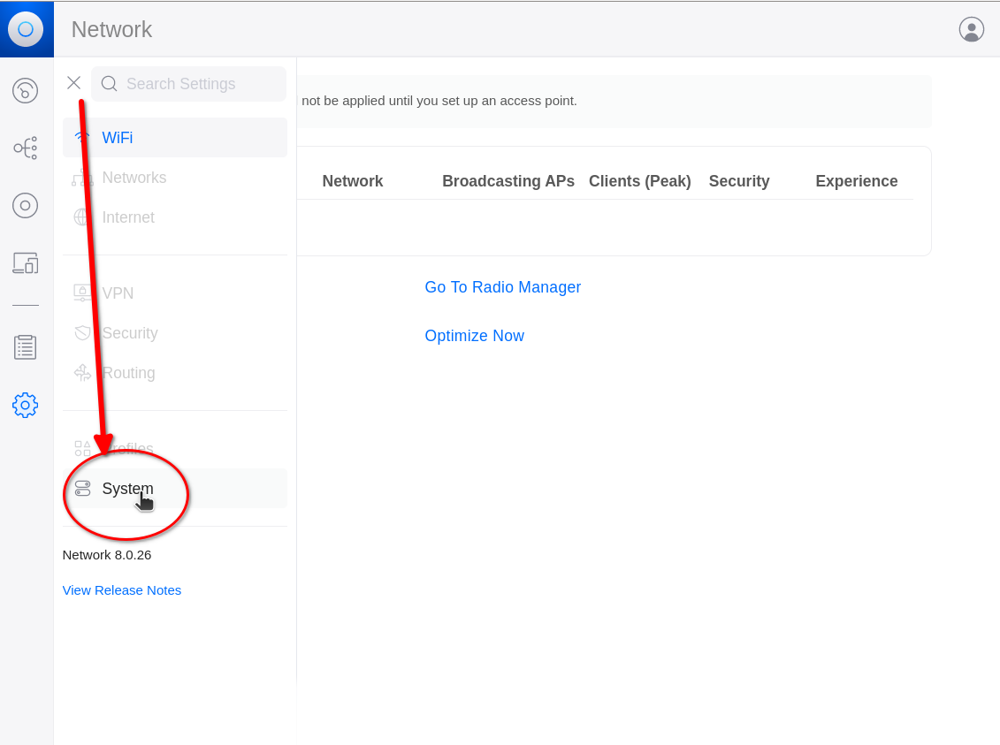
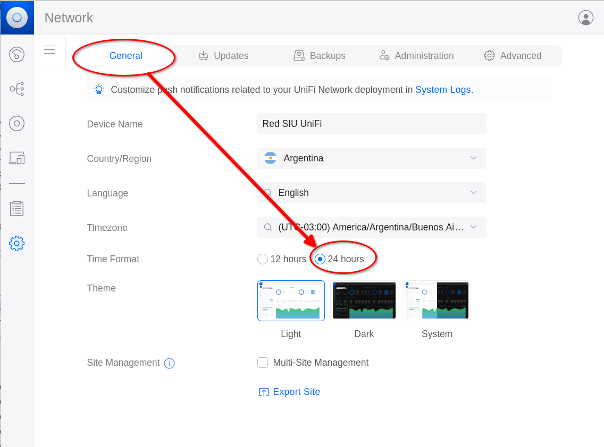
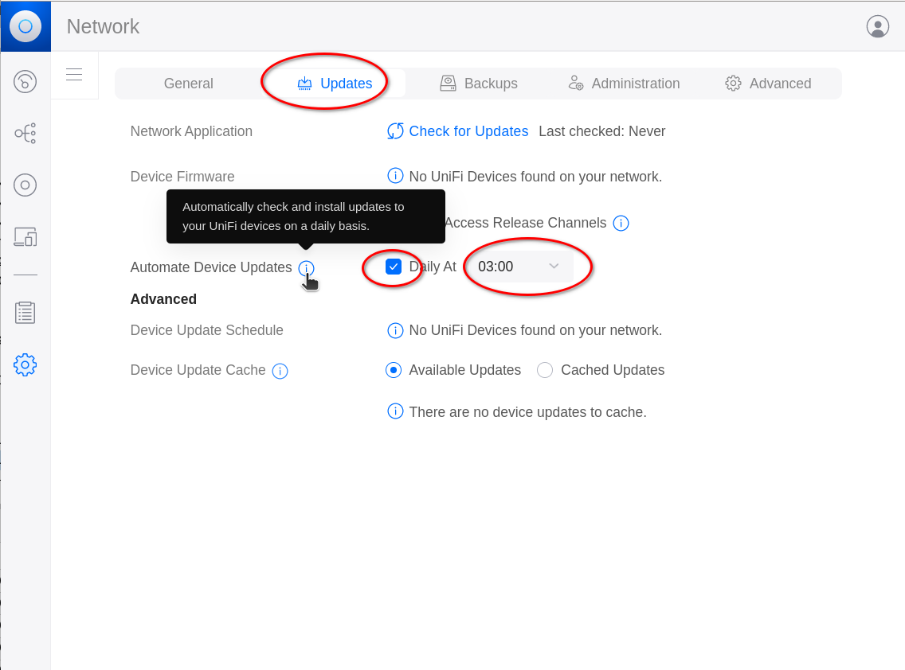
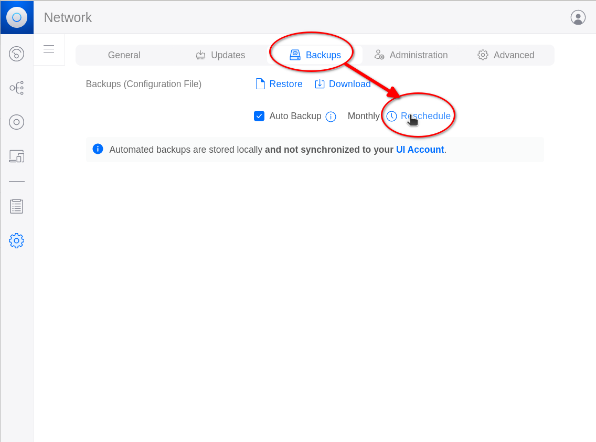

[[_TOC_]]

# Restauración de backup

Si se tiene una configuración backupeada anteriormente, se puede restaurar
integramente para no tener que configurar nuevamente el sistema. Si no (o si es
una instalación inicial) hay que hacer las [configuraciones generales del
sistema](#configuraciones-del-sistema-system)

* Ir a **Settings** :arrow_right: **System**

* Ir a la sección **Backups**
  * Seleccionar **Restore**

  * Seleccionar (en la máquina local) el archivo que contiene el backup a
restaurar (son archivos con extensión **`.unf`**)
  * Una vez seleccionado, aparece un mensaje indicando que el archivo está
subiendo al servidor (no interrumpir este proceso porque podría cortarse la
subida del archivo)
  * Cuando termina de subir, aparece una ventana para confirmar. Hacerlo
apretando el botón **Restore**
  * Luego de apretarlo, aparecerá un mensaje indicando que se está restaurando
el backup. Si son sólo configuraciones, debería ser bastante rápido. Si el
backup tiene información adicional de mucho tiempo, podría tardar varios
minutos)

# Configuraciones del sistema (System)

* Ir a **Settings** :arrow_right: **System**

## Generales 
* Ir a la sección **General**
  * Verificar que la **_Timezone_** sea la correcta
  * Elegir formato de hora de 24 horas

## Actualizaciones
* Ir a la sección **Updates**
  * Verificar si se quieren hacer updates automáticos de _firmware_ de los
dispositivos (el _default_ es sí hacerlos)
  * Definir a qué hora se deben hacer los chequeos (el _default_ es a las 3 de
la madrugada)

## Backups
* Ir a la sección **Backups**
  * Por _default_ se backupean automáticamente las configuraciones una vez por
mes
  * Para cambiar esto, seleccionar **Reschedule**
  * Luego, configurar la frecuencia (por ejemplo _Daily_), la hora (_00:30_)
la cantidad máxima de backups a retener (_60_) y si se deben guardar sólo las
configuraciones (_Settings Only_, que es el default) o si también se hará backup
de los datos de conexiones y demás (puede ocupar mucho espacio)

## Administración
* Ir a la sección **Administration**
  * Aquí se pueden agregar más usuarios del sistema

## Avanzadas
* Ir a la sección **Advanced**
  * Poner **Debug Tools** en **On** para permitir lanzar una terminal en los
dispositivos desde la consola
  * Habilitar el envío de correo en **Email Services** con **Custom Server**
y configurando los parámetros para enviar mail

  * Habilitar SNMP y configurarlo si se desea monitorear la consola

  * Configurar el acceso SSH a los dispositivos:
    * El server utiliza SSH para el acceso a los dispositivos
    * Por default, utiliza el usuario **admin** y una clave autogenerada durante
la instalación
    * La clave se puede ver seleccionando el "ojito" en el campo **Password**
    * Si se cambian estos datos será necesario re-adoptar los dispositivos que
ya se hubieran adoptado
    * Para tener acceso ssh directo a los dispositivos, lo mejor es agregar las
claves públicas SSH de los usuarios administradores que necesiten el acceso

  * Si se quiere utilizar **Wireless Meshing** pero la red de gestión de los
dispositivos no tiene un _default gateway_ configurar en **Custom IP** una
dirección IP en esa red que siempre funcione (por ejemplo, si la consola tiene
una dirección en esa red, se puede utilizar esa dirección IP)
  * Finalmente, no olvidar aplicar los cambios para que sean efectivos:

