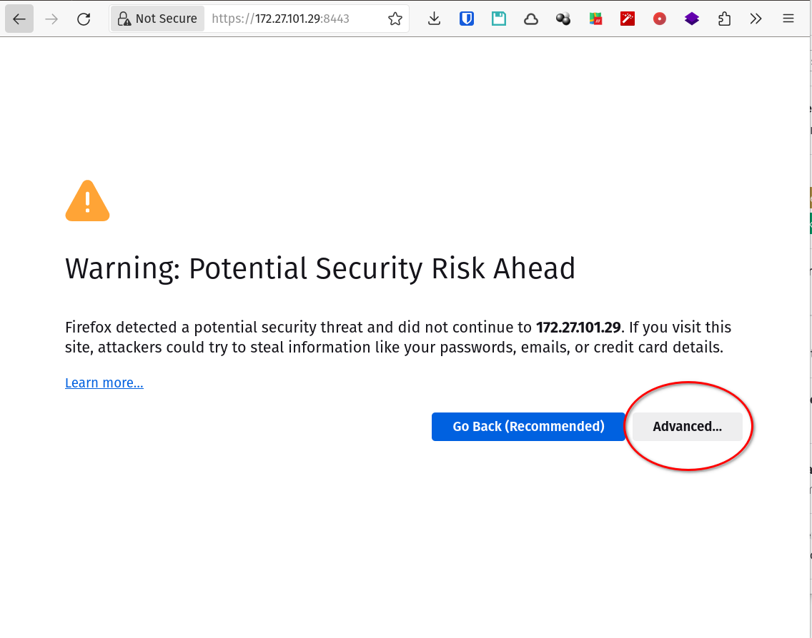
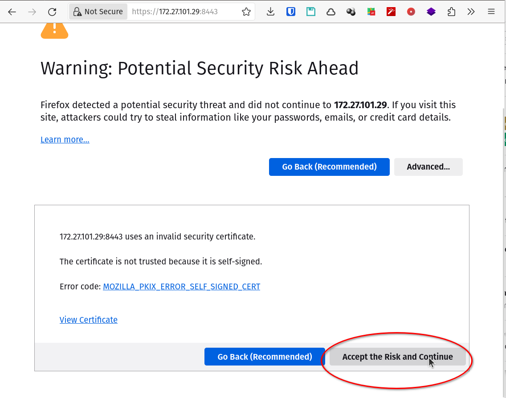

[[_TOC_]]

# Instalación fácil

[Glenn Rietveld (a.k.a _UI Glenn_)](https://glennr.nl/) es un ingeniero de
soporte a la comunidad empleado de [Ubiquiti](https://ui.com) que posteó en los
[foros de la comunidad de Ubiquiti](https://community.ui.com/) unos scripts
que permiten instalar [UniFi Network](UniFi_Network.md) en modo _self hosted_ en
un montón de distribuciones de Linux.

Tanto [la entrada en el
foro](https://community.ui.com/questions/UniFi-Installation-Scripts-or-UniFi-Easy-Update-Script-or-UniFi-Lets-Encrypt-or-UniFi-Easy-Encrypt-/ccbc7530-dd61-40a7-82ec-22b17f027776)
como [los scripts en sí](https://glennr.nl/s/unifi-network-controller) los
actualiza con frecuencia, tanto cuando salen versiones nuevas de la [UniFi
Network Application](https://help.ui.com/hc/en-us/articles/360012282453-Self-Hosting-a-UniFi-Network-Server)
como cuando versiones nuevas de las distros.

En enero de 2024, [Tom Lawrence](https://lawrencesystems.com/) sacó una nueva
versión de su [video de instalación del UniFi Self Hosted Controller
Setup](https://youtu.be/LP4dIl8Y_Xw) usando el script de UI Glenn.

En resumen, para instalar **UniFi Network App** (a.k.a. UniFi Network
Controller) en modo _self hosted_ lo mejor es usar el script de UI Glenn.

## TL;DR

* [Instrucciones para instalar **UniFi Network App** en video](https://youtu.be/LP4dIl8Y_Xw)
* [Instrucciones para instalar **UniFi Network App** escritas por el autor del
script](https://community.ui.com/questions/UniFi-Installation-Scripts-or-UniFi-Easy-Update-Script-or-UniFi-Lets-Encrypt-or-UniFi-Easy-Encrypt-/ccbc7530-dd61-40a7-82ec-22b17f027776)

Los pasos son los siguientes:
* bajar el script
* ejecutarlo
* contestar todas las preguntas con el default (**`Y`**)

```
curl -O https://get.glennr.nl/unifi/install/install_latest/unifi-latest.sh
sudo bash unifi-latest.sh
```

Las preguntas que fueron apareciendo (al instalar la versión 8.1.113 en Debian
12) fueron las siguientes:

Preguntas que va haciendo (a _todas_ les contesto **`Y`**, que es el default):

```
#########################################################################

# The script generates support files when failures are detected, these can help Glenn R. to
# improve the script quality for the Community and resolve your issues in future versions of the script.

# Do you want to automatically upload the support files? (Y/n)
```


```
#########################################################################

# Do you want to keep the script on your system after completion? (Y/n)
```

```
#########################################################################

# Checking if your system is up-to-date...

# Running apt-get update...
# Successfully ran apt-get update!

# The package(s) below can be upgraded!

----

# There are no packages that need an upgrade...

----

# Do you want to proceed with updating your system? (Y/n)
```

```
#########################################################################

# Would you like to update the UniFi Network Application via APT?
# Do you want the script to add the source list file? (Y/n)
```

Al terminar muestra el URL para entrar por IP con certificado autofirmado:
```
#########################################################################

# UniFi Network Application 8.1.113 has been installed successfully
# Your application address: https://172.27.101.64:8443


# UniFi is active ( running )


# Author   |  Glenn R.
# Email    |  glennrietveld8@hotmail.nl
# Website  |  https://GlennR.nl

```

Para arrancar, parar o reiniciar la aplicación se utiliza `systemd` (el script
de instalación lo arranca y lo configura para que arranque automáticamente al
bootear):
```
sudo systemctl start unifi.service
sudo systemctl stop unifi.service
sudo systemctl restart unifi.service
```

Los logs de control (arranque/parada) de la aplicación se pueden ver con
```
sudo journalctl -u 'unifi' -e
```

Los logs del servidor se mantienen en **`/var/log/unifi`**.

Los datos del servidor se almacenan en **`/var/lib/unifi`**.

## Ingresar via web

Para usar la aplicación hay que ir a `https://<IP-DEL-EQUIPO>:8443` que es el
URL que informó el script de instalación al terminar. 

Ubiquiti recomienda utilizar **Chrome**, pero Firefox parece funcionar sin
problemas.

Al entrar a esa URL van a aparecer los clásicos avisos de seguridad por estar
utilizando un certificado autofirmado (de hecho, entrando por https con
dirección IP siempre va a ocurrir esto).

Hay que decirle que se acepta el riesgo y seguir adelante:





Para evitar estos errores, se puede instalar un [Caddy](Caddy.md) para usar de
proxy reverso con certificados obtenidos vía LetsEncrypt.

## Setup inicial via web

Si se hizo esta instalación para reemplazar una versión anterior y se había
hecho un backup, el siguiente paso es [**restaurar** la instalación anterior del
último **backup**](UniFi_Network-Restore_inicial.md)

Si es una instalación completamente nueva, al entrar por primera vez hay que
hacer un [**setup inicial**](UniFi_Network-Setup_inicial.md)

# Actualización de versión

Ver [instrucciones para actualizar la versión de UniFi
Network](UniFi_Network-Actualizacion-version.md)


---

# Instalación difícil (y desactualizada)

Las instrucciones originales las dejamos
[acá](UniFi_Network-Instalacion_dificil.md) como referencia histórica

