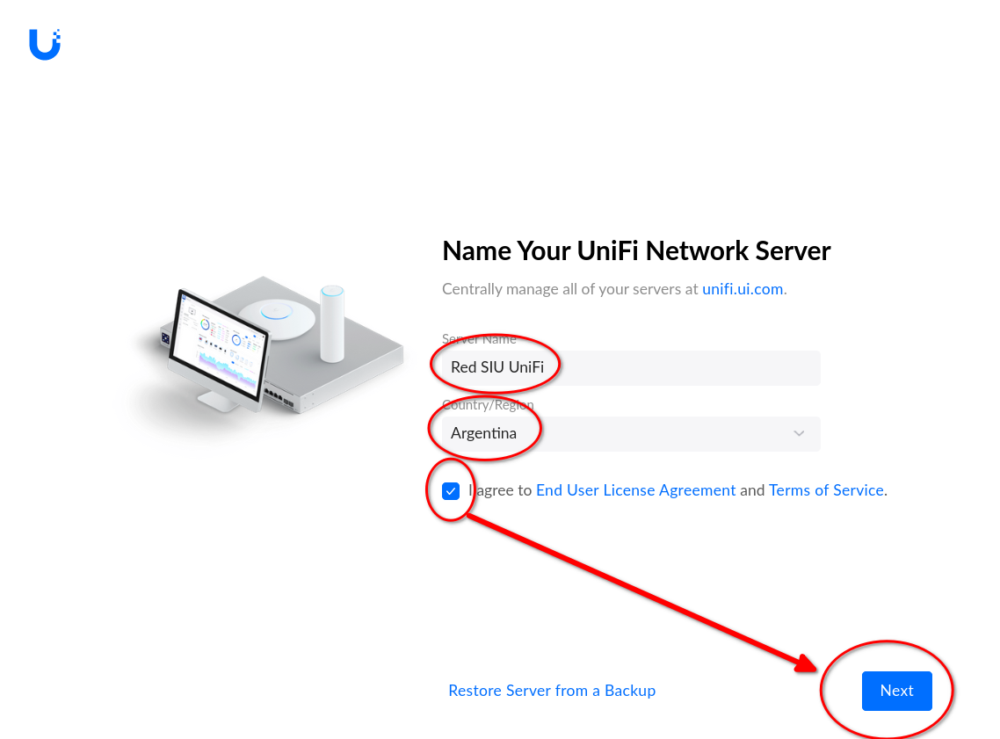
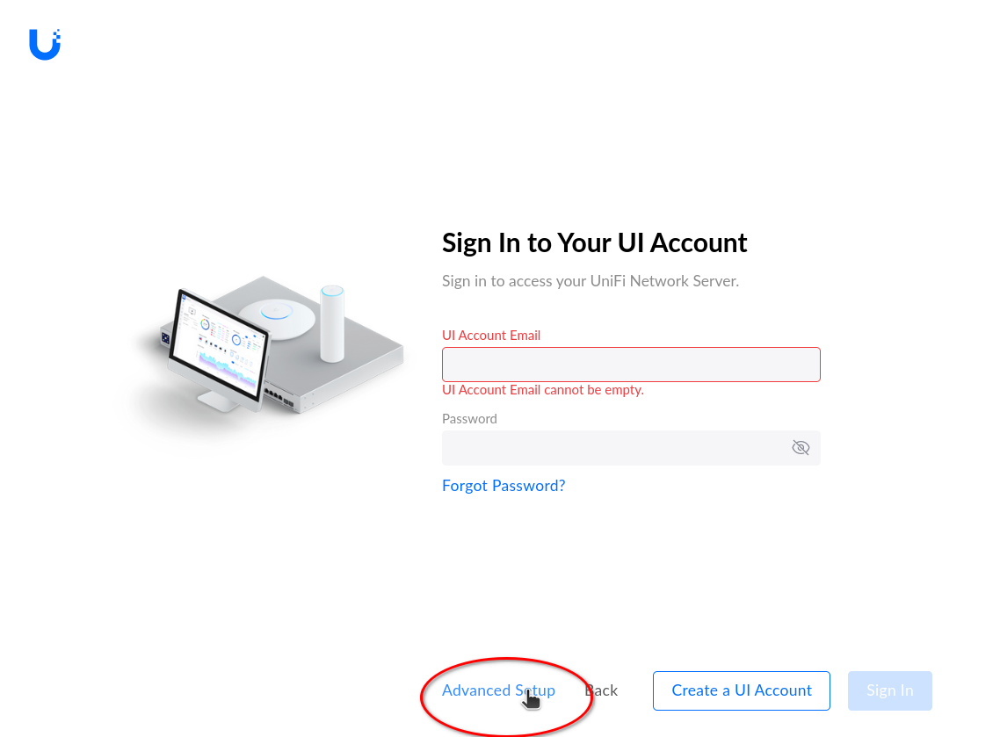
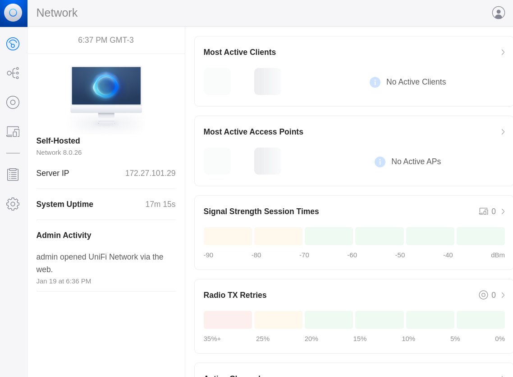

[[_TOC_]]

## Setup inicial de UniFi Network

Al entrar por primera vez hay que crear la cuenta de administrador y configurar
la red:

### Nombre global de la red y país

* Configurar el nombre que se le dará a la red
* Configurar el país donde se instalan los dispositvos
* Aprobar la licencia final de usuario y los términos del servicio

### Pasar a setup avanzado

* En lugar de loguearse con una cuenta de UI, pasar a la configuración avanzada

* Saltear el paso para crear una cuenta (en UI)

### Credenciales locales

* Crear, en cambio, un usuario local, configurarle su clave y su mail

## Fin

Al finalizar, aparece el _dashboard_ inicial de la consola

A continuación, proceder a realizar la [configuración
general](UniFi_Network-Configuracion_general.md)

