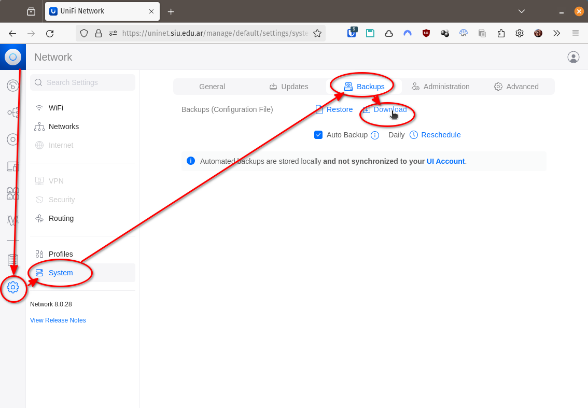
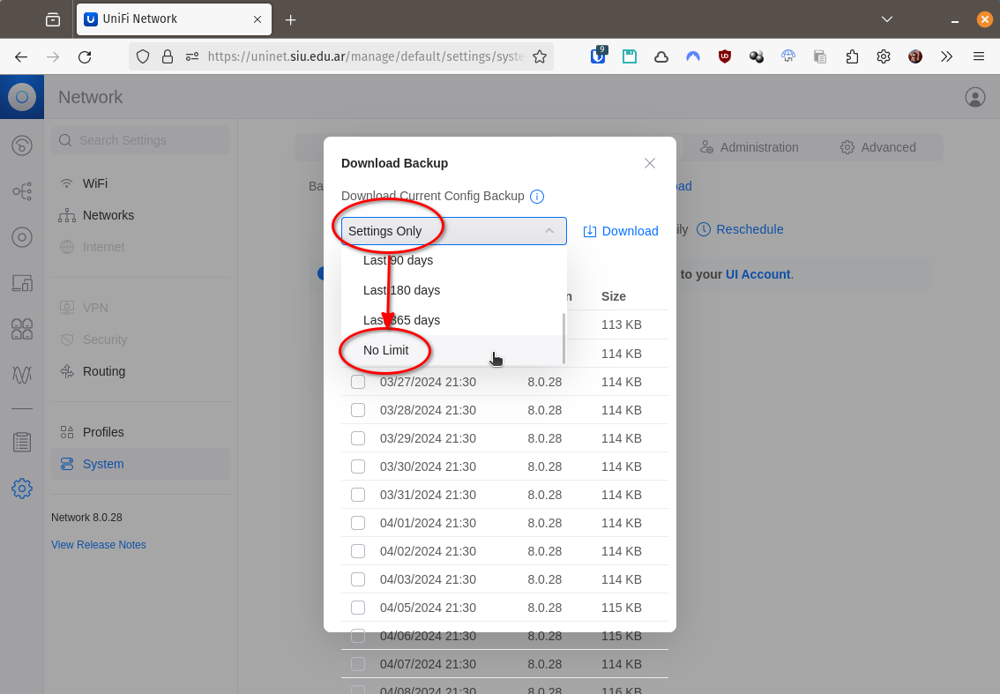
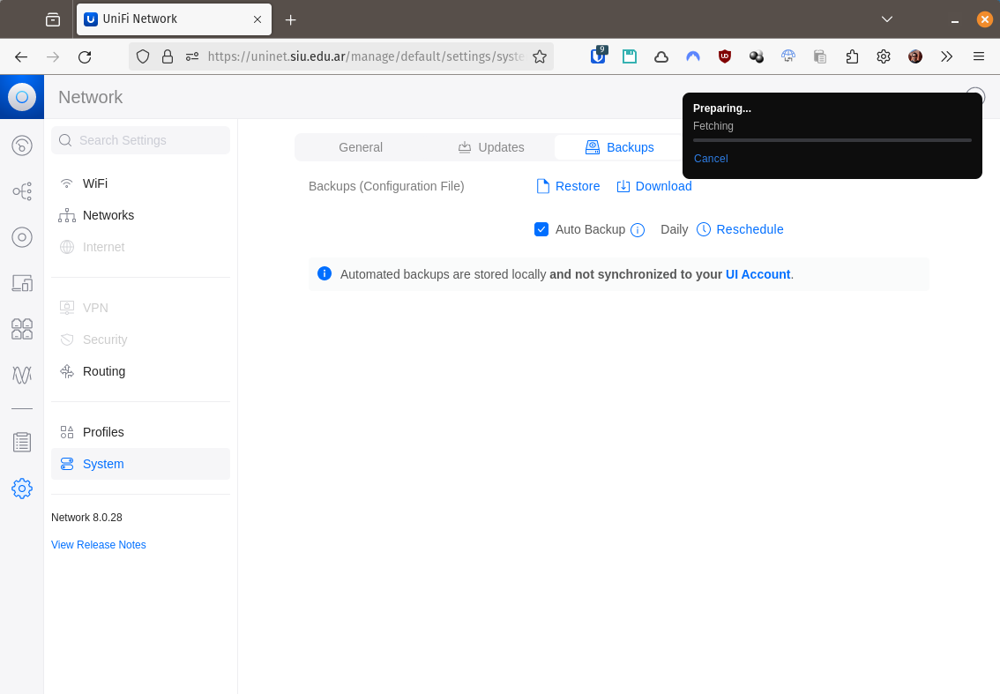

## Backup completo

Para migrar una instalación de [UniFi Network](UniFi_Network.md) de un equipo a
otro, si no se quieren perder datos históricos hay que hacer un backup completo.

Esto puede tardar **horas**.

Ingresar a la consola e ir a:
* **Dashboard** :arrow_right: **Settings** :arrow_right: **System**
:arrow_right: **Backups** :arrow_right: **Download**

* En el combo que está inicializado con **Settings Only** seleccionar **No
Limit**

* Seleccionar la opción **Download**

* Armarse de _mucha_ paciencia y esperar viendo esta pantalla:

___
<!-- LICENSE -->
___

  
Este documento está licenciado en los términos de una <a rel="licencia"
href="https://creativecommons.org/licenses/by-sa/4.0/deed.es">
Licencia Atribución-CompartirIgual 4.0 Internacional de Creative Commons</a>.
  
This document is licensed under a <a rel="license" 
href="https://creativecommons.org/licenses/by-sa/4.0/deed.en">
Creative Commons Attribution-ShareAlike 4.0 International License</a>.
<!-- END --> 
