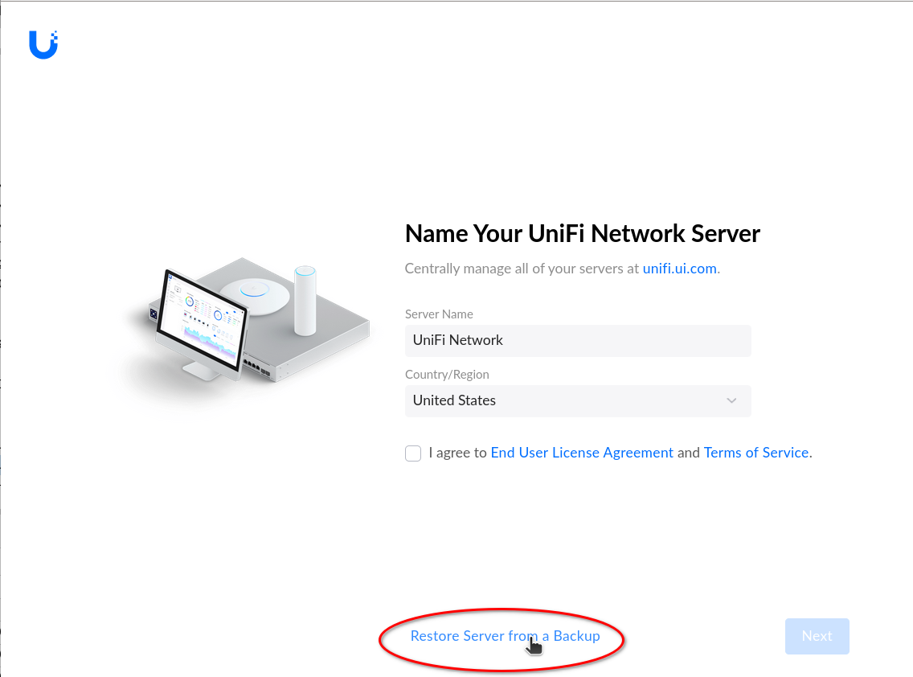
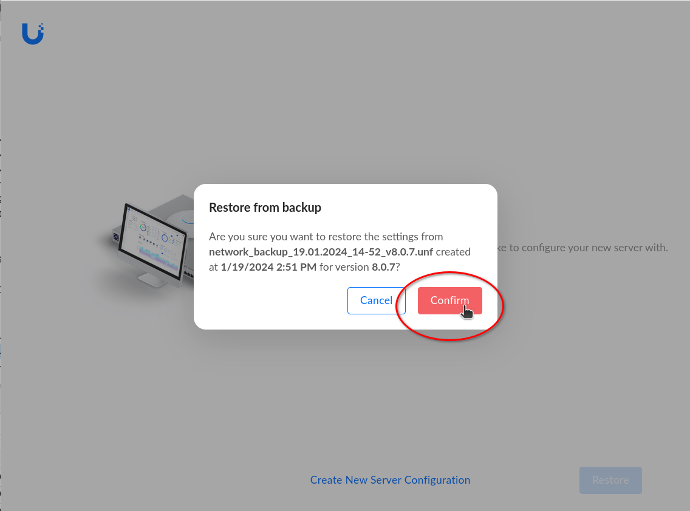
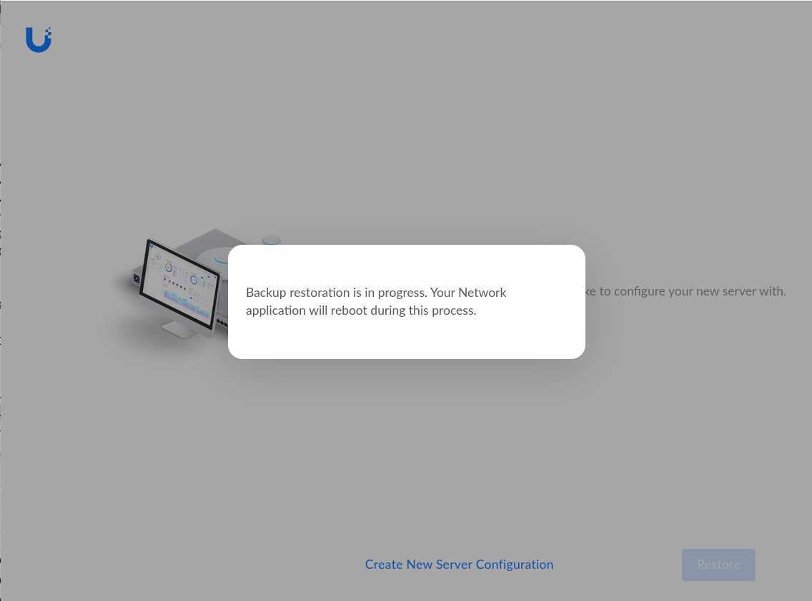
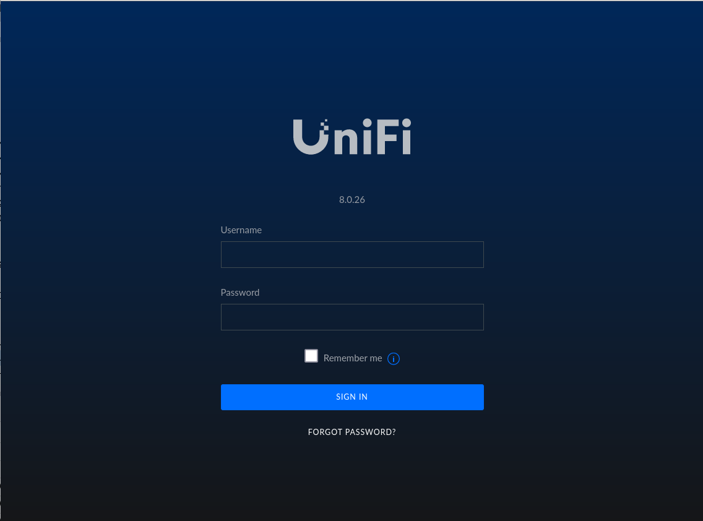

## Restauración inicial

Al entrar por primera vez a una consola recién instalada, si se cuenta con un
backup de una instalación anterior, se puede restaurar directamente sin hacer
la configuración inicial.

En la primera pantalla que aparece, en lugar de configurar el nombre de la red,
país, etc., seleccionar directamente la opción **Restore Server from a Backup**
y luego **Upload Backup File**

  * Seleccionar (en la máquina local) el archivo que contiene el backup a
restaurar (son archivos con extensión **`.unf`**)
  * Una vez seleccionado, aparece un mensaje indicando que el archivo está
subiendo al servidor (no interrumpir este proceso porque podría cortarse la
subida del archivo)
  * Cuando termina de subir, aparece una ventana **Restore from backup** para 
confirmar. Hacerlo apretando el botón **Confirm**

  * Luego aparecerá un mensaje mientras se está restaurando (esto puede durar
varios minutos)
  * Finalmente, se reiniciará la aplicación y aparecerá la pantalla de login
  * Ingresar con las credenciales de la instalación restaurada

___
<!-- LICENSE -->
___

  
Este documento está licenciado en los términos de una <a rel="licencia"
href="https://creativecommons.org/licenses/by-sa/4.0/deed.es">
Licencia Atribución-CompartirIgual 4.0 Internacional de Creative Commons</a>.
  
This document is licensed under a <a rel="license" 
href="https://creativecommons.org/licenses/by-sa/4.0/deed.en">
Creative Commons Attribution-ShareAlike 4.0 International License</a>.
<!-- END --> 
