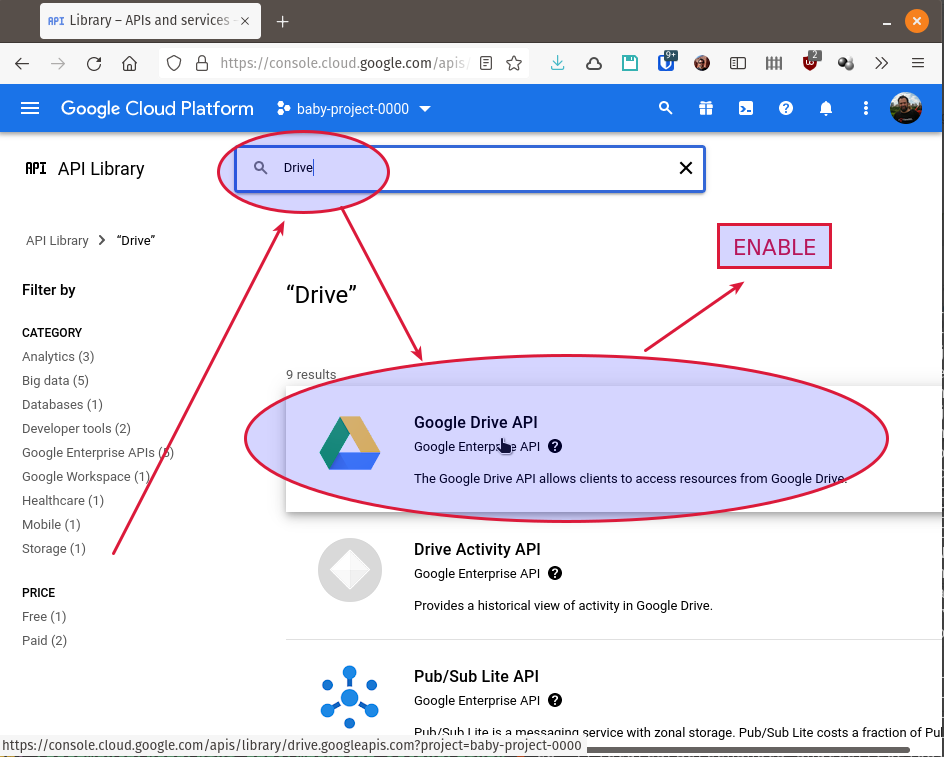

# Creación de client_id para la API de Google Drive

Si bien las instrucciones básicas funcionan bien, es recomendable [crear tu propio client_id](https://rclone.org/drive/#making-your-own-client-id) porque la API de Google limita la frecuencia de consultas por client-id y, si no creás y utilizás el tuyo propio, vas a estar usando el propio de rclone que, si bien tiene un límite bastante alto, es compartido por la mayoría de los usuarios de rclone.

1. Entrá en tu [consola de Google API](https://console.developers.google.com/) con tu cuenta de Google (puede ser cualquier cuenta Google, no es necesario que sea la misma que la de Google Drive al que te vas a conectar).

2. Seleccioná un proyecto creá uno nuevo

3. En "**+ ENABLE APIs AND SERVICES**" 

buscá "**Drive**" y habilitá la "**Google Drive API**"

y volvé al _dashboard_ de la consola de APIs

4. La primera vez tenés que crear la "**OAuth consent screen**". Tenés que seleccionar de tipo "**External**", ponerle un nombre y agregar los "**Test Users**" (que tienen que ser los que se van a conectar al Google Drive usando rclone)

5. Seleccioná "**Credentials**" en el menú de la izquierda y luego apretá "**+ CREATE CREDENTIALS**" y seleccioná "**OAuth client ID**"

6. Apretá "**Application type**" y seleccioná "**Desktop app**"

7. Ponele un nombre (o dejá el que viene por _default_) y apretá "**CREATE**"

8. Anotá el "_Client ID_" y el "_Client Secret_" que te muestra en la pantalla siguiente

9. Volvé a la "**OAuth consent screen**" y apretá "**PUBLISH APP**"

___
<!-- LICENSE -->
___
 Este documento está licenciado en los términos de una <a rel="licencia" href="http://creativecommons.org/licenses/by-sa/4.0/deed.es">Licencia Atribución-CompartirIgual 4.0 Internacional de Creative Commons</a>.

 This document is licensed under a <a rel="license" href="http://creativecommons.org/licenses/by-sa/4.0/deed.en">Creative Commons Attribution-ShareAlike 4.0 International License</a>.
<!-- END --> 
