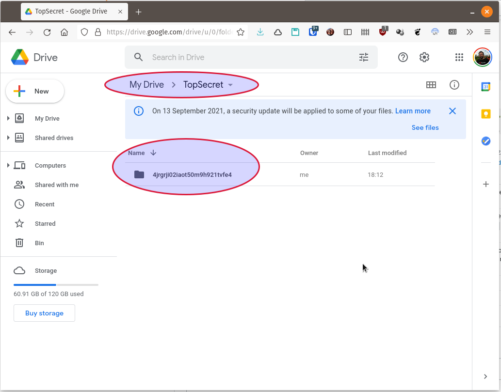
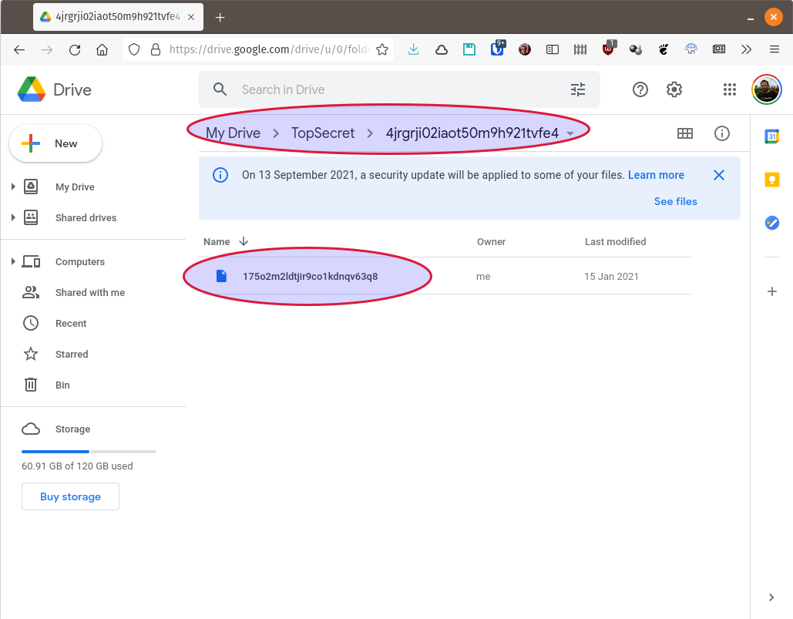
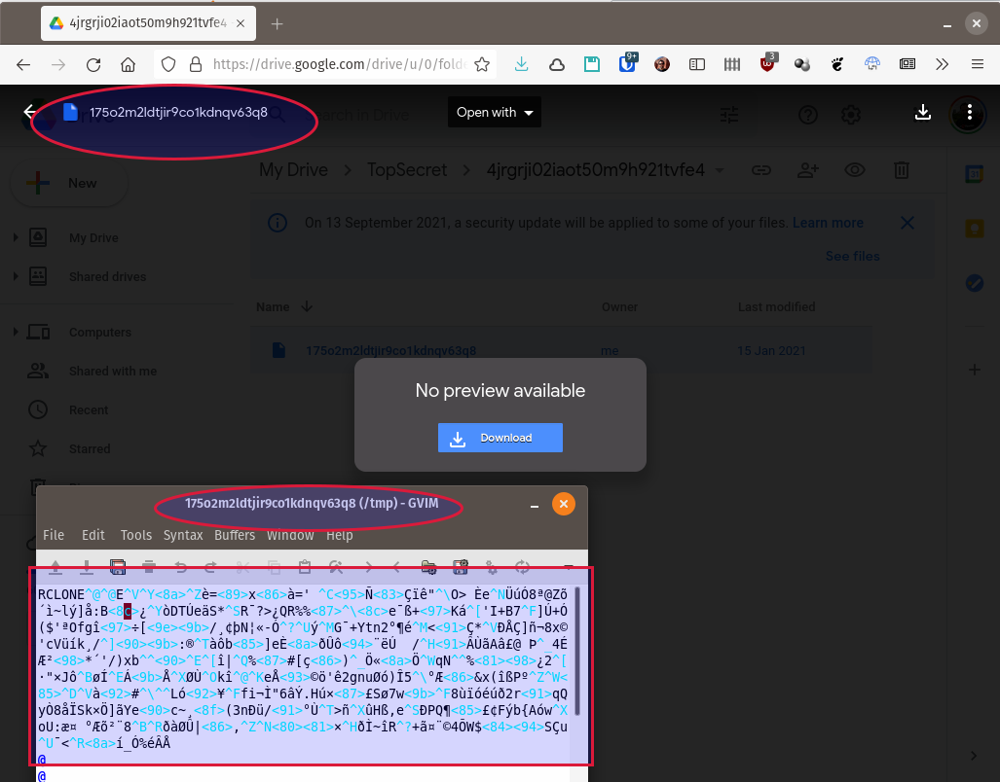

# Crypt ([crypt](https://rclone.org/crypt/)) (pseudo-remoto para encriptar _otros_ remotos)

<!--ts-->
   * [Configuración](#configuración)
      * [Archivo de configuración](#archivo-de-configuración)
   * [Uso](#uso)

<!-- Added by: baby, at: Sun 15 Aug 19:02:37 -03 2021 -->

<!--te-->

**[Crypt](https://rclone.org/crypt/)** no es un _backend_ remoto, sino que se 
usa como una **capa** _encima_ de _otro_ "remoto".

Cuando accedés a un remoto a través del remoto _crypt_ arriba del mismo, rclone 
hace encripción/desencripción del lado del cliente, de modo tal que lo que se 
transmite y se almacena en el remoto que está debajo del _crypt_ está encriptado 
y no se puede ver.

La encripción es _simétrica_ (misma clave para encriptar y desencriptar). La 
password (y la _sal_) la podés elegir vos o dejar que la genere rclone. 
De cualquiera de ambos modos, la clave y la _sal_ se van a guardar en el archivo 
de configuración **`~/.config/rclone/rclone.conf`** en una forma ofuscada. 
**Ojo**, esta ofuscación sólo sirve para que una vista casual del archivo no 
revele una clave fácilmente legible, pero **_no está encriptada ni hasheada_**.

Es **MUY IMPORTANTE** que **_nadie_** tenga acceso a ese archivo, ya que, 
en particular, la información que está allí es suficiente para desencriptar el
contenido guardado en el remoto debajo de la capa _crypt_ (de hecho, podríamos 
copiar ese pedazo a otra computadora y utilizar rclone en la otra computadora
para tener acceso al remoto encriptado).

Si perdés la clave y/o la _sal_ **no hay forma de recuperar el contenido que
quedó encriptado**, así que hacé un **_backup seguro_** del archivo de
configuración **`~/.config/rclone/rclone.conf`**.

Para más sobre el funcionamiento y algoritmos usados, ver la [documentación
del remoto crypt de rclone](https://rclone.org/crypt/).

## Configuración

Vamos a crear un nuevo remoto llamado **CarpetaSeguraEnGDrive** dentro de una 
carpeta **TopSecret** dentro del remoto **GoogleDriveRemote** 
([que ya debe estar creado](remote-drive.md)).

Primero creamos la carpeta dentro del remoto: 
```
rclone mkdir GoogleDriveRemote:TopSecret
```

Y ahora, usando el comando `rclone config` creamos el nuevo remoto encriptado 
sobre esa carpeta en forma interactiva:
```
$ rclone config
Current remotes:

Name                 Type
====                 ====
GoogleDriveRemote    drive

e) Edit existing remote
n) New remote
d) Delete remote
r) Rename remote
c) Copy remote
s) Set configuration password
q) Quit config
e/n/d/r/c/s/q> n
name> CarpetaSeguraEnGDrive
Type of storage to configure.
Enter a string value. Press Enter for the default ("").
Choose a number from below, or type in your own value
 1 / 1Fichier
   \ "fichier"
 2 / Alias for an existing remote
   \ "alias"
 3 / Amazon Drive
   \ "amazon cloud drive"
<SNIP>
10 / Dropbox
   \ "dropbox"
11 / Encrypt/Decrypt a remote
   \ "crypt"
12 / Enterprise File Fabric
   \ "filefabric"
13 / FTP Connection
   \ "ftp"
14 / Google Cloud Storage (this is not Google Drive)
   \ "google cloud storage"
15 / Google Drive
   \ "drive"
<SNIP>
41 / http Connection
   \ "http"
42 / premiumize.me
   \ "premiumizeme"
43 / seafile
   \ "seafile"
Storage> crypt
Remote to encrypt/decrypt.
Normally should contain a ':' and a path, e.g. "myremote:path/to/dir",
"myremote:bucket" or maybe "myremote:" (not recommended).
Enter a string value. Press Enter for the default ("").
remote> GoogleDriveRemote:TopSecret
How to encrypt the filenames.
Enter a string value. Press Enter for the default ("standard").
Choose a number from below, or type in your own value
 1 / Encrypt the filenames see the docs for the details.
   \ "standard"
 2 / Very simple filename obfuscation.
   \ "obfuscate"
 3 / Don't encrypt the file names.  Adds a ".bin" extension only.
   \ "off"
filename_encryption> standard
Option to either encrypt directory names or leave them intact.

NB If filename_encryption is "off" then this option will do nothing.
Enter a boolean value (true or false). Press Enter for the default ("true").
Choose a number from below, or type in your own value
 1 / Encrypt directory names.
   \ "true"
 2 / Don't encrypt directory names, leave them intact.
   \ "false"
directory_name_encryption> true
Password or pass phrase for encryption.
y) Yes type in my own password
g) Generate random password
y/g> g
Password strength in bits.
64 is just about memorable
128 is secure
1024 is the maximum
Bits> 1024
Your password is: <UnaCosaMuyLargaQueTenésQueAnotarSiVasAQuererUsarEsteRemotoEnOtroLado>
Use this password? Please note that an obscured version of this 
password (and not the password itself) will be stored under your 
configuration file, so keep this generated password in a safe place.
y) Yes (default)
n) No
y/n> y
Password or pass phrase for salt. Optional but recommended.
Should be different to the previous password.
y) Yes type in my own password
g) Generate random password
n) No leave this optional password blank (default)
y/g/n> g
Password strength in bits.
64 is just about memorable
128 is secure
1024 is the maximum
Bits> 128
Your password is: <UnaCosaNoTanLargaQueTambiénTenésQueAnotarSiVasAQuererUsarEsteRemotoEnOtroLado>
Use this password? Please note that an obscured version of this 
password (and not the password itself) will be stored under your 
configuration file, so keep this generated password in a safe place.
y) Yes (default)
n) No
y/n> y
Edit advanced config?
y) Yes
n) No (default)
y/n> n
--------------------
[CarpetaSeguraEnGDrive]
type = crypt
remote = GoogleDriveRemote:TopSecret
password = *** ENCRYPTED ***
password2 = *** ENCRYPTED ***
--------------------
y) Yes this is OK (default)
e) Edit this remote
d) Delete this remote
y/e/d> y
Current remotes:

Name                 Type
====                 ====
CarpetaSeguraEnGDrive crypt
GoogleDriveRemote    drive

e) Edit existing remote
n) New remote
d) Delete remote
r) Rename remote
c) Copy remote
s) Set configuration password
q) Quit config
e/n/d/r/c/s/q> q
```

### Archivo de configuración

Las dos passwords (una funciona como principal y la otra como _sal_) quedaron
guardadas en el archivo de configuración **`~/.config/rclone/rclone.conf`** de 
forma _levemente_ ofuscada. 
**Ojo**, esta ofuscación sólo sirve para que una vista casual del archivo no 
revele una clave fácilmente legible, pero **_no está encriptada ni hasheada_**.

Es **MUY IMPORTANTE** que **_nadie_** tenga acceso a ese archivo, ya que, 
en particular, la información que está allí es suficiente para desencriptar el
contenido guardado en el remoto debajo de la capa _crypt_ (de hecho, podríamos 
copiar ese pedazo a otra computadora y utilizar rclone en la otra computadora
para tener acceso al remoto encriptado).

Ahora este remoto referencia al contenido de una carpeta dentro de Google Drive
que, si se la mira directamente lo único que se puede discernir es la estructura
del árbol de directorios y cantidad de archivos en cada uno, pero no los nombres
ni los contenidos de los mismos.

## Uso

Para copiar un archivo desde el disco local a la carpeta encriptada:
```
rclone mkdir CarpetaSeguraEnGDrive:claves
rclone copy /etc/passwd CarpetaSeguraEnGDrive:claves
```

Si queremos ver las carpetas y los archivos encriptados:
```
$ rclone lsd CarpetaSeguraEnGDrive:
          -1 2021-08-15 18:12:00        -1 claves
$ rclone ls CarpetaSeguraEnGDrive:
     3103 claves/passwd
```

Pero si entramos por la interfaz de gdrive, sólo vemos carpetas y archivos con
nombres y contenido encriptados:






Para **copiar** un **directorio** del disco local a la carpeta encriptada en el 
Google Drive:
```
rclone copy ~/devel/proyecto_secreto CarpetaSeguraEnGDrive:proyectoX
```

Para **montar** la carpeta encriptada en el Google Drive como un filesystem en 
un directorio local (vacío):
```
rclone mount CarpetaSeguraEnGDrive: /mnt/seguro-en-gdrive --vfs-cache-mode full --daemon
```

Para **desmontar** el filesystem:
```
fusermount -u /mnt/seguro-en-gdrive
```

___
<!-- LICENSE -->
___
<a rel="licencia" href="https://creativecommons.org/licenses/by-sa/4.0/deed.es">
</a>
<br /><br />
Este documento está licenciado en los términos de una <a rel="licencia"
href="https://creativecommons.org/licenses/by-sa/4.0/deed.es">
Licencia Atribución-CompartirIgual 4.0 Internacional de Creative Commons</a>.
<br /><br />
This document is licensed under a <a rel="license" 
href="https://creativecommons.org/licenses/by-sa/4.0/deed.en">
Creative Commons Attribution-ShareAlike 4.0 International License</a>.
<!-- END --> 
