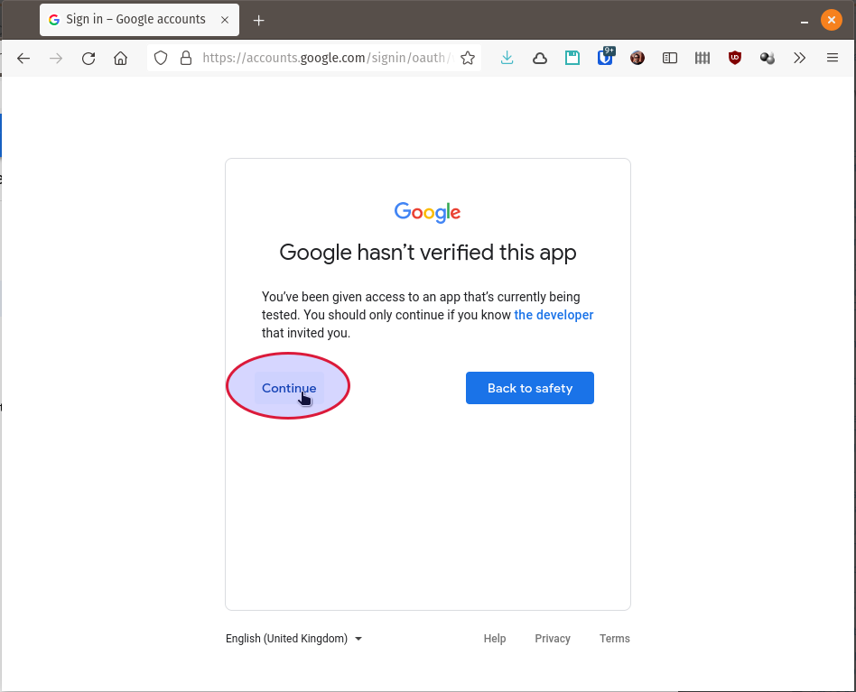
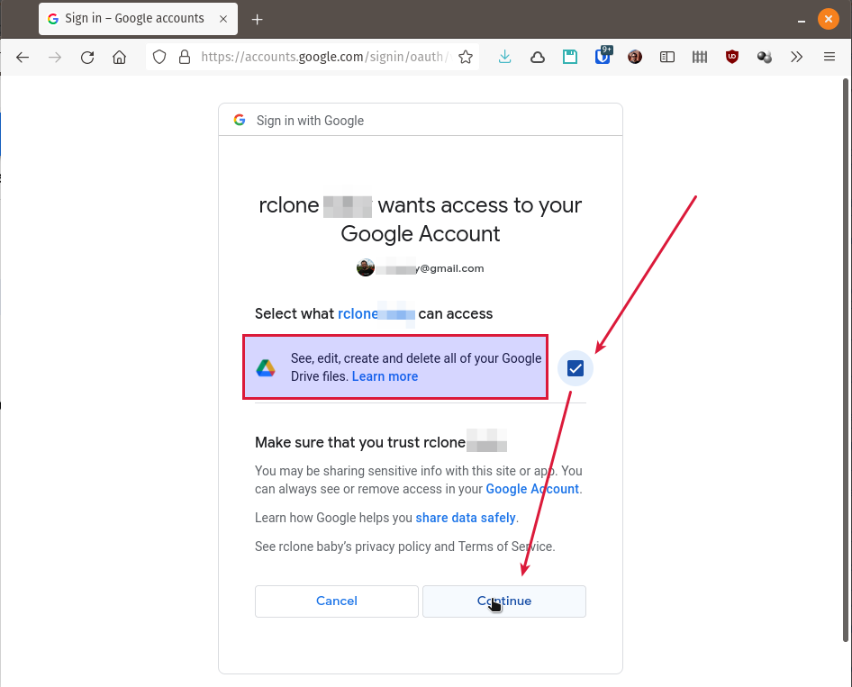
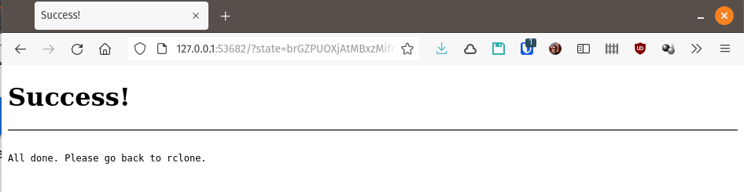

# Google Drive ([drive](https://rclone.org/drive/))

<!--ts-->
   * [Configuración](#configuración)
      * [Autenticación y autorización (en Google)](#autenticación-y-autorización-en-google)
      * [Archivo de configuración](#archivo-de-configuración)
   * [Uso](#uso)
   * [Expiración de la autenticación/autorizacion](#expiración-de-la-autenticaciónautorizacion)

<!-- Added by: baby, at: Tue 17 Aug 09:51:37 -03 2021 -->

<!--te-->

Si bien las instrucciones básicas funcionan bien, es recomendable [crear tu 
propio client_id para usar la API de Google Drive](GoogleDriveClientID.md) 
porque la API de Google limita la frecuencia de consultas por client_id y, si no 
creás y utilizás el tuyo propio, vas a estar usando el propio de rclone que, si 
bien tiene un límite bastante alto, es compartido por la mayoría de los usuarios 
de rclone (los que _no_ se toman el laburo de crear su client_id).

## Configuración

Vamos a crear un nuevo remoto llamado **GoogleDriveRemote** usando el comando 
`rclone config` en forma interactiva:
```
$ rclone config

No remotes found - make a new one
n) New remote
s) Set configuration password
q) Quit config
n/s/q> n
name> GoogleDriveRemote
```

Ahora nos muestra un listado completo de todos los _backends_ disponibles para 
elegir (recorto un poco). Tipeo "_drive_" que es el identificador para Google 
Drive (el número podría cambiar en una versión distinta de rclone, pero el 
identificador difícilmente cambie).
```
Type of storage to configure.
Enter a string value. Press Enter for the default ("").
Choose a number from below, or type in your own value
 1 / 1Fichier
   \ "fichier"
 2 / Alias for an existing remote
   \ "alias"
<SNIP>
13 / FTP Connection
   \ "ftp"
14 / Google Cloud Storage (this is not Google Drive)
   \ "google cloud storage"
15 / Google Drive
   \ "drive"
16 / Google Photos
   \ "google photos"
17 / Hadoop distributed file system
   \ "hdfs"
<SNIP>
41 / http Connection
   \ "http"
42 / premiumize.me
   \ "premiumizeme"
43 / seafile
   \ "seafile"
Storage> drive
Google Application Client Id
Setting your own is recommended.
See https://rclone.org/drive/#making-your-own-client-id for how to create your own.
If you leave this blank, it will use an internal key which is low performance.
Enter a string value. Press Enter for the default ("").
client_id> 

```
Acá es donde tenemos que poner los datos que obtuvimos al [crear nuestro propio 
client_id](GoogleDriveClientID.md) (si no lo hicimos, dejamos en blanco).
```
Enter a string value. Press Enter for the default ("").
client_id> 123456789012-unasarasaconl3tr4synum3r0s.apps.googleusercontent.com
OAuth Client Secret
Leave blank normally.
Enter a string value. Press Enter for the default ("").
client_secret> MuyS3cret03Zto-abcd
Scope that rclone should use when requesting access from drive.
Enter a string value. Press Enter for the default ("").
Choose a number from below, or type in your own value
 1 / Full access all files, excluding Application Data Folder.
   \ "drive"
 2 / Read-only access to file metadata and file contents.
   \ "drive.readonly"
   / Access to files created by rclone only.
 3 | These are visible in the drive website.
   | File authorization is revoked when the user deauthorizes the app.
   \ "drive.file"
   / Allows read and write access to the Application Data folder.
 4 | This is not visible in the drive website.
   \ "drive.appfolder"
   / Allows read-only access to file metadata but
 5 | does not allow any access to read or download file content.
   \ "drive.metadata.readonly"
scope> drive
ID of the root folder
Leave blank normally.

Fill in to access "Computers" folders (see docs), or for rclone to use
a non root folder as its starting point.

Enter a string value. Press Enter for the default ("").
root_folder_id> 
Service Account Credentials JSON file path 
Leave blank normally.
Needed only if you want use SA instead of interactive login.

Leading `~` will be expanded in the file name as will environment variables such as `${RCLONE_CONFIG_DIR}`.

Enter a string value. Press Enter for the default ("").
service_account_file> 
Edit advanced config?
y) Yes
n) No (default)
y/n> n
Use auto config?
 * Say Y if not sure
 * Say N if you are working on a remote or headless machine

y) Yes (default)
n) No
y/n> y
2021/08/13 19:43:58 NOTICE: Make sure your Redirect URL is set to "urn:ietf:wg:oauth:2.0:oob" in your custom config.
2021/08/13 19:43:58 NOTICE: If your browser doesn't open automatically go to the following link: http://127.0.0.1:53682/auth?state=brGZPUOXjAtMBxzMifrDUw
2021/08/13 19:43:58 NOTICE: Log in and authorize rclone for access
2021/08/13 19:43:58 NOTICE: Waiting for code...
```

### Autenticación y autorización (en Google)

Acá va a abrirse una ventana en el navegador para autorizar el acceso al google 
drive. Si no estás logueado en Google, tenés que loguearte con la cuenta de la 
cual querés usar el Google Drive.

Si usaste un client_id propio, recién creado, lo primero que te aparece es una 
ventana diciendo que la aplicación **no está verificada**. Esto es porque no 
hiciste el proceso de verificación de la aplicación (no tiene sentido hacerlo, 
ni sé cómo se hace). Si dejaste el campo client_id en blanco, esto no te va a 
aparecer. Apretá "**Continue**" aunque te recomiende hacer lo contrario.



A continuación te aparece la ventana pidiendo que selecciones qué cosas puede 
acceder rclone en tu cuenta, con un único ítem que es acceso a leer, modificar, 
crear y borrar todos los archivos de tu Google Drive. Tenés que seleccionar el 
_checkbox_ y apretar "**Continue**"



Si todo está bien, te aparece una pantalla diciéndote que vuelvas a rclone (ya 
podés cerrar la ventana del navegador que estuviste usando)



De regreso en la consola linux:
```
2021/08/13 19:43:58 NOTICE: Make sure your Redirect URL is set to "urn:ietf:wg:oauth:2.0:oob" in your custom config.
2021/08/13 19:43:58 NOTICE: If your browser doesn't open automatically go to the following link: http://127.0.0.1:53682/auth?state=brGZPUOXjAtMBxzMifrDUw
2021/08/13 19:43:58 NOTICE: Log in and authorize rclone for access
2021/08/13 19:43:58 NOTICE: Waiting for code...
2021/08/13 20:03:01 NOTICE: Got code
Configure this as a Shared Drive (Team Drive)?

y) Yes
n) No (default)
y/n> n
--------------------
[GoogleDriveRemote]
type = drive
client_id = 123456789012-unasarasaconl3tr4synum3r0s.apps.googleusercontent.com
client_secret = MuyS3cret03Zto-abcd
scope = drive
token = {"access_token":"aca.van_UNmontónDeLetrasYnúm3r0sQueFormanEl_TOKEN-queLeDevolvióGúguelCuandoLoAutorizasteAtenerAccesoAtuGoogleDrive-ESTO_es_IMPORTANTÍSIMO_queNoLoVeaNadie","token_type":"Bearer","refresh_token":"1//másCosasRelacionadasConElToken-queNoTengoMuyEnClaroParaQuéSON-peroIgualEstoQueNoLoVeaNadie1234567890","expiry":"2021-08-13T21:03:00.885058093-03:00"}
team_drive =
--------------------
y) Yes this is OK (default)
e) Edit this remote
d) Delete this remote
y/e/d> y
Current remotes:

Name                 Type
====                 ====
GoogleDriveRemote    drive

e) Edit existing remote
n) New remote
d) Delete remote
r) Rename remote
c) Copy remote
s) Set configuration password
q) Quit config
e/n/d/r/c/s/q> q
```

### Archivo de configuración

Esto creó (o modificó) el archivo de configuración 
**`~/.config/rclone/rclone.conf`** y puso los datos para acceder al remoto que 
mostró al final del proceso allí:
```
[GoogleDriveRemote]
type = drive
client_id = 123456789012-unasarasaconl3tr4synum3r0s.apps.googleusercontent.com
client_secret = MuyS3cret03Zto-abcd
scope = drive
token = {"access_token":"aca.van_UNmontónDeLetrasYnúm3r0sQueFormanEl_TOKEN-queLeDevolvióGúguelCuandoLoAutorizasteAtenerAccesoAtuGoogleDrive-ESTO_es_IMPORTANTÍSIMO_queNoLoVeaNadie","token_type":"Bearer","refresh_token":"1//másCosasRelacionadasConElToken-queNoTengoMuyEnClaroParaQuéSON-peroIgualEstoQueNoLoVeaNadie1234567890","expiry":"2021-08-13T21:03:00.885058093-03:00"}
team_drive =
```

Es **MUY IMPORTANTE** que **_nadie_** tenga acceso a ese archivo, ya que, en 
particular, la información que está allí es suficiente para entrar al Google 
Drive sin que pueda volver a pedir autenticación ni autorización (de hecho, 
podríamos copiar ese pedazo a otra computadora y utilizar rclone directamente).

## Uso

Ahora puedo usar los subcomandos de `rclone` para acceder al Google Drive usando 
el nombre del remoto que creé recién (`GoogleDriveRemote`) usando la [sintaxis 
de los _paths_ remotos](https://rclone.org/docs/#syntax-of-remote-paths).

Para **listar las carpetas** del primer nivel del drive:
```
$ rclone lsd GoogleDriveRemote:
          -1 2020-09-29 08:35:48        -1 Capacitacion
          -1 2021-06-04 10:36:25        -1 Entretenimiento
          -1 2018-06-24 09:52:53        -1 Personal
          -1 2019-03-05 09:13:16        -1 Trabajo
```

Para **listar todos los archivos** en todas las carpetas:
```
$ rclone ls GoogleDriveRemote:
   323014 Archivo en la raíz del drive.pdf
       -1 Otro archivo en la raíz.docx
 12114285 Capacitacion/Curso_aburrido.pptx
223346379 Entretenimiento/Otra película.mov
335161310 Entretenimiento/Una película.mp4
<SNIP>
  4613162 Capacitacion/No está ordenado.pdf
```

Para **copiar** un **directorio** del disco local al Google Drive:
```
rclone copy ~/devel/proyecto_interesante GoogleDriveRemote:Trabajo/proyectoX
```

Para **montar** el Google Drive como un filesystem en un directorio local 
(vacío):
```
rclone mount GoogleDriveRemote: /mnt/google-drive --vfs-cache-mode full --daemon
```

Para **desmontar** el filesystem:
```
fusermount -u /mnt/google-drive
```

## Expiración de la autenticación/autorizacion
Del mismo modo que en un navegador, aún cuando se lo designa como "seguro" para
no tener que autenticarse cada vez, los _tokens_ de autenticación se vencen y
es necesario volver a solicitar la autorización.

La necesidad de hacer esto lo vemos al ejecutar cualquier subcomando de `rclone`
contra un remoto y recibir un mensaje similar a este:
```
$ rclone copy algo GoogleDriveRemote:algunacarpeta
2021/08/17 09:21:14 Failed to create file system for "GoogleDriveRemote:/": couldn't find root directory ID: Get "https://www.googleapis.com/drive/v3/files/root?alt=json&fields=id&prettyPrint=false&supportsAllDrives=true": couldn't fetch token - maybe it has expired? - refresh with "rclone config reconnect GoogleDriveRemote:": oauth2: cannot fetch token: 400 Bad Request
Response: {
  "error": "invalid_grant",
  "error_description": "Bad Request"
}

```

Para volver a solicitar la autorización debemos usar `rclone config reconnect` 
con el nombre del remoto:
```
$ rclone config reconnect GoogleDriveRemote:
Already have a token - refresh?
y) Yes (default)
n) No
y/n> y
Use auto config?
 * Say Y if not sure
 * Say N if you are working on a remote or headless machine

y) Yes (default)
n) No
y/n> y
2021/08/17 09:39:34 NOTICE: Make sure your Redirect URL is set to "urn:ietf:wg:oauth:2.0:oob" in your custom config.
2021/08/17 09:39:34 NOTICE: If your browser doesn't open automatically go to the following link: http://127.0.0.1:53682/auth?state=88DMLFT_db9KpEnWTh74fw
2021/08/17 09:39:34 NOTICE: Log in and authorize rclone for access
2021/08/17 09:39:34 NOTICE: Waiting for code...
```
Aquí se volverá a abrir el navegador y a solicitar el proceso de [autenticación
y autorización OAuth2 (en Google)](#autenticación-y-autorización-en-google) 
igual que al conectarse por primera vez al drive.

Completar la autorización igual que [antes](
#autenticación-y-autorización-en-google) y luego continuar en la terminal:
```
2021/08/17 09:39:34 NOTICE: Make sure your Redirect URL is set to "urn:ietf:wg:oauth:2.0:oob" in your custom config.
2021/08/17 09:39:34 NOTICE: If your browser doesn't open automatically go to the following link: http://127.0.0.1:53682/auth?state=88DMLFT_db9KpEnWTh74fw
2021/08/17 09:39:34 NOTICE: Log in and authorize rclone for access
2021/08/17 09:39:34 NOTICE: Waiting for code...
2021/08/17 09:40:27 NOTICE: Got code
Configure this as a Shared Drive (Team Drive)?

y) Yes
n) No (default)
y/n> n
```


___
<!-- LICENSE -->
___
<a rel="licencia" href="http://creativecommons.org/licenses/by-sa/4.0/deed.es">
</a>
<br /><br />
Este documento está licenciado en los términos de una <a rel="licencia"
href="http://creativecommons.org/licenses/by-sa/4.0/deed.es">
Licencia Atribución-CompartirIgual 4.0 Internacional de Creative Commons</a>.
<br /><br />
This document is licensed under a <a rel="license" 
href="http://creativecommons.org/licenses/by-sa/4.0/deed.en">
Creative Commons Attribution-ShareAlike 4.0 International License</a>.
<!-- END --> 
