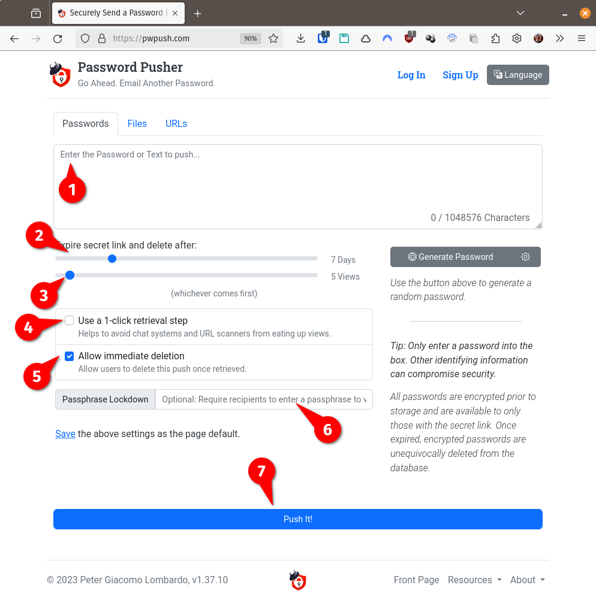

# Mandar una password por mail en forma (razonablemente) segura

Hace poco descubrí un sistemita hermoso llamado [Password Pusher (o
pwpush)](https://pwpush.com/) que sin necesidad de registrarse ni nada, te
permite generar un URL privado a la contraseña guardada temporalmente en un
server y enviarla por mail (o SMS, WhatsApp, Telegram o lo que fuere).

El URL se borra automáticamente cuando la contraseña se vio más de una cantidad
configurable de veces o si pasó una cantidad de días también configurable.
El URL también lo puede borrar el que lo creó manualmente.

De este modo, una vez que se borró el URL, por más que alguien tenga acceso al
mail, no podrá ver la clave.

Hay un [FAQ](https://pwpush.com/en/pages/faq) (también [en
castellano](https://pwpush.com/es/paginas/faq)) donde se explica esto un poco
más.

El uso es muy simple:

1) Acá ingresás la clave que querés compartir (opcionalmente, podés apretar el
botón **Generate Password** y pwpush va a generar una clave aleatoria).

2) Elegí cuántos días querés que dure el link (quizás el default de 7 días es
mucho).

3) Elegí cuántas veces se puede abrir (el default de 5 es razonable).

4) Esto lo recomiendo _prender_. Es común que los antivirus/antispam de los
mails y chats intenten ver qué hay en el link, ya sea para ver que no es un
_phishing_ o algo dañino, o (por ejemplo en WhatsApp o Telegram) para mostrar
un _preview_ además del link. El problema es que cada vez que algún robot
intenta ver qué hay en el link gasta una vista. Si seleccionás la opción "**Use
a 1-click retrieval step**", esto va a agregar simplemente `/r` al final del
URL, que va a mostrar una página que dice "_Haga click aquí para obtener la
clave_", sin gastar una vista.

5) Esto permite que el receptor, una vez que vio y guardó la clave pueda borrar
el URL manualmente.

6) Acá te permite poner una clave para abrir el URL pero, obviamente, hay que
ver cómo se transmite esta clave. Se puede utilizar y enviar esta clave por
otro medio, pero yo no lo uso.

7) Finalmente, cuando está todo listo, al apretar este botón se genera el URL,
te lo muestra y lo podés copiar y pegar en un mail, SMS, WhatsApp o lo que sea.

Además, te podés registrar/inscribir con un mail y contraseña y con eso podés
también compartir archivos a través de un URL secreto, o un URL escondido dentro
de otro.

También te da control sobre los URLs que generaste, te permite ver cuántas veces
se vieron, cuántos días pasaron y borrarlos manualmente.

___
<!-- LICENSE -->
___

  
Este documento está licenciado en los términos de una <a rel="licencia"
href="https://creativecommons.org/licenses/by-sa/4.0/deed.es">
Licencia Atribución-CompartirIgual 4.0 Internacional de Creative Commons</a>.
  
This document is licensed under a <a rel="license" 
href="https://creativecommons.org/licenses/by-sa/4.0/deed.en">
Creative Commons Attribution-ShareAlike 4.0 International License</a>.
<!-- END --> 
